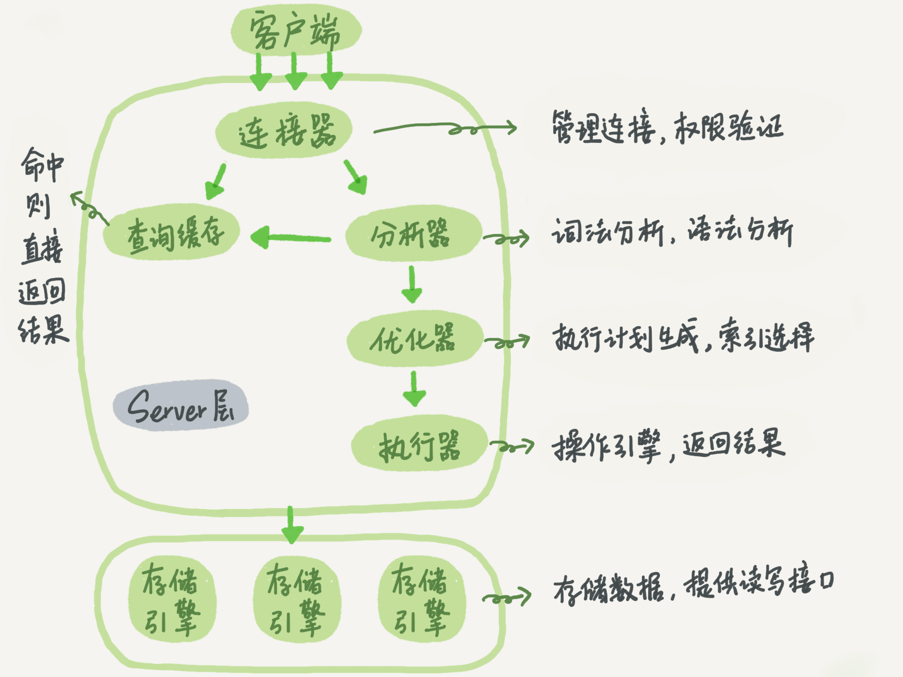
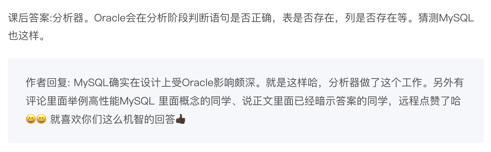

# 1.基础架构：一条SQL查询语句是如何执行的？

下面我给出的是 MySQL 的基本架构示意图，从中你可以清楚地看到 SQL 语句在 MySQL 的各个功能模块中的执行过程。



MySQL 可以分为 Server 层和存储引擎层两部分。

Server 层包括连接器、查询缓存、分析器、优化器、执行器等，涵盖 MySQL 的大多数核心服务功能，以及所有的内置函数（如日期、时间、数学和加密函数等），所有跨存储引擎的功能都在这一层实现，比如存储过程、触发器、视图等。

而存储引擎层负责数据的存储和提取。其架构模式是插件式的，支持 InnoDB、MyISAM、Memory 等多个存储引擎。现在最常用的存储引擎是 InnoDB，它从 MySQL 5.5.5 版本开始成为了默认存储引擎。

## 连接器

一个用户成功建立连接后，即使你用管理员账号对这个用户的权限做了修改，也不会影响已经存在连接的权限。修改完成后，只有再新建的连接才会使用新的权限设置。

客户端如果太长时间没动静，连接器就会自动将它断开。这个时间是由参数 wait_timeout 控制的，默认值是 8 小时。

数据库里面，长连接是指连接成功后，如果客户端持续有请求，则一直使用同一个连接。短连接则是指每次执行完很少的几次查询就断开连接，下次查询再重新建立一个。

使用长连接后，你可能会发现，有些时候 MySQL 占用内存涨得特别快，这是因为 MySQL 在执行过程中临时使用的内存是管理在连接对象里面的。这些资源会在连接断开的时候才释放。所以如果长连接累积下来，可能导致内存占用太大，被系统强行杀掉（OOM），从现象看就是 MySQL 异常重启了。

两种方式解决上面这个问题：

1. 定期断开长连接。使用一段时间，或者程序里面判断执行过一个占用内存的大查询后，断开连接，之后要查询再重连。
2. 如果你用的是 MySQL 5.7 或更新版本，可以在每次执行一个比较大的操作后，通过执行 mysql_reset_connection 来重新初始化连接资源。这个过程不需要重连和重新做权限验证，但是会将连接恢复到刚刚创建完时的状态。

## 查询缓存

MySQL 拿到一个查询请求后，会先到查询缓存看看，之前是不是执行过这条语句。之前执行过的语句及其结果可能会以 key-value 对的形式，被直接缓存在内存中。key 是查询的语句，value 是查询的结果。如果你的查询能够直接在这个缓存中找到 key，那么这个 value 就会被直接返回给客户端。

但是大多数情况下我会建议你不要使用查询缓存，为什么呢？因为查询缓存往往弊大于利。

查询缓存的失效非常频繁，只要有对一个表的更新，这个表上所有的查询缓存都会被清空。

MySQL 8.0 版本直接将查询缓存的整块功能删掉了

## 分析器

没啥好说的，主要是分析语法

## 优化器

```shell
mysql> select * from t1 join t2 using(ID)  where t1.c=10 and t2.d=20;
```

既可以先从表 t1 里面取出 c=10 的记录的 ID 值，再根据 ID 值关联到表 t2，再判断 t2 里面 d 的值是否等于 20。

也可以先从表 t2 里面取出 d=20 的记录的 ID 值，再根据 ID 值关联到 t1，再判断 t1 里面 c 的值是否等于 10。

这两种执行方法的逻辑结果是一样的，但是执行的效率会有不同，而优化器的作用就是决定选择使用哪一个方案。

## 执行器

假如表 T 中，ID 字段没有索引，那么执行器的执行流程是这样的：

1. 调用 InnoDB 引擎接口取这个表的第一行，判断 ID 值是不是 10，如果不是则跳过，如果是则将这行存在结果集中；
2. 调用引擎接口取“下一行”，重复相同的判断逻辑，直到取到这个表的最后一行。
3. 执行器将上述遍历过程中所有满足条件的行组成的记录集作为结果集返回给客户端。

## 小问题

如果表 T 中没有字段 k，而你执行了这个语句 select * from T where k=1, 那肯定是会报“不存在这个列”的错误： “Unknown column ‘k’ in ‘where clause’”。你觉得这个错误是在我们上面提到的哪个阶段报出来的呢？

### 解答



