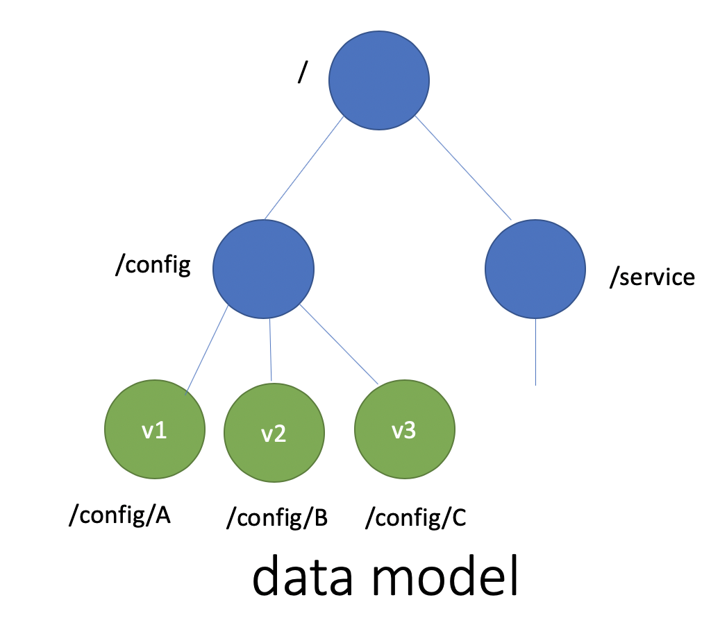
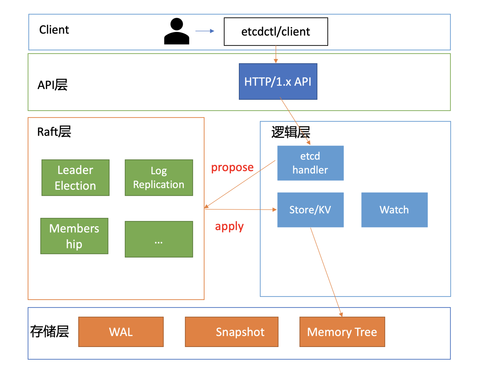
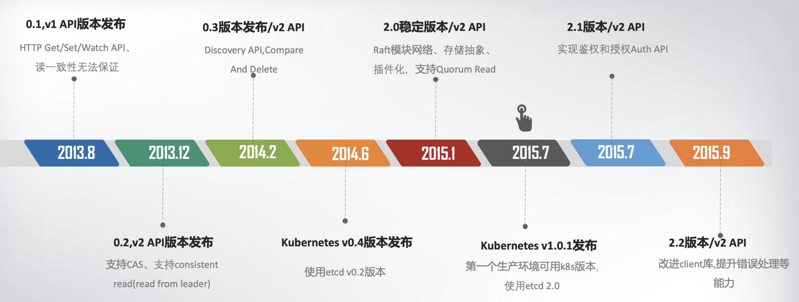
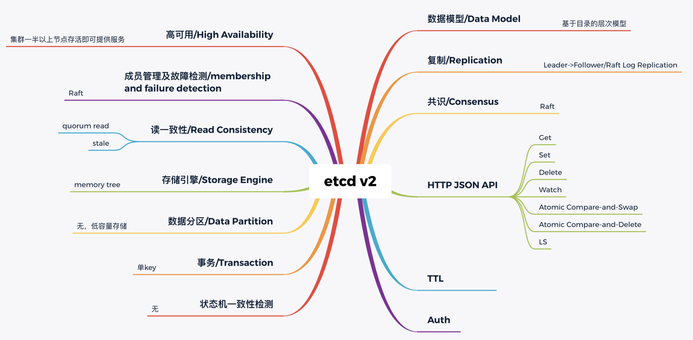
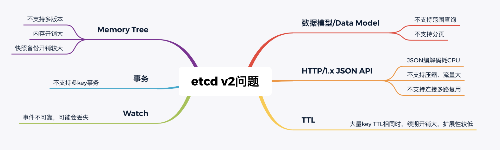
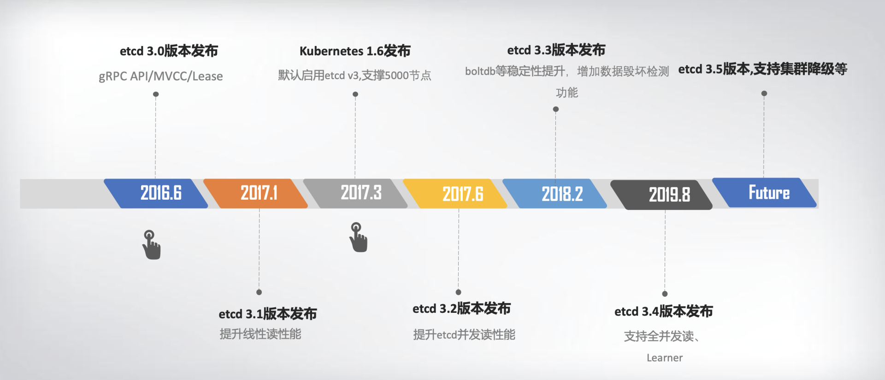

- 

2013 年，有一个叫 CoreOS 的创业团队，他们构建了一个产品，Container Linux，它是一个开源、轻量级的操作系统，侧重自动化、快速部署应用服务，并要求应用程序都在容器中运行，同时提供集群化的管理方案，用户管理服务就像单机一样方便。

他们希望在重启任意一节点的时候，用户的服务不会因此而宕机，导致无法提供服务，因此需要运行多个副本。但是多个副本之间如何协调，如何避免变更的时候所有副本不可用呢？

CoreOS 团队需要一个协调服务来存储服务配置信息、提供分布式锁等能力。

理想状态下要能满足以下目标：

1. **可用性角度：高可用。协调服务作为集群的控制面存储，它保存了各个服务的部署、运行信息。**若它故障，可能会导致集群无法变更、服务副本数无法协调。业务服务若此时出现故障，无法创建新的副本，可能会影响用户数据面。
2. **数据一致性角度：提供读取“最新”数据的机制。**既然协调服务必须具备高可用的目标，就必然不能存在单点故障（single point of failure），而多节点又引入了新的问题，即多个节点之间的数据一致性如何保障？比如一个集群 3 个节点 A、B、C，从节点 A、B 获取服务镜像版本是新的，但节点 C 因为磁盘 I/O 异常导致数据更新缓慢，若控制端通过 C 节点获取数据，那么可能会导致读取到过期数据，服务镜像无法及时更新。
3. **容量角度：低容量、仅存储关键元数据配置。**协调服务保存的仅仅是服务、节点的配置信息（属于控制面配置），而不是与用户相关的数据。所以存储上不需要考虑数据分片，无需过度设计。
4. **功能：增删改查，监听数据变化的机制。**协调服务保存了服务的状态信息，若服务有变更或异常，相比控制端定时去轮询检查一个个服务状态，若能快速推送变更事件给控制端，则可提升服务可用性、减少协调服务不必要的性能开销。
5. **运维复杂度：可维护性。在分布式系统中往往会遇到硬件 Bug、软件 Bug、人为操作错误导致节点宕机，以及新增、替换节点等运维场景，都需要对协调服务成员进行变更。**若能提供 API 实现平滑地变更成员节点信息，就可以大大降低运维复杂度，减少运维成本，同时可避免因人工变更不规范可能导致的服务异常。

**为什么不选择zookeeper？**

从高可用性、数据一致性、功能这三个角度来说，ZooKeeper 是满足 CoreOS 诉求的。然而**当时的 ZooKeeper 不支持通过 API 安全地变更成员，需要人工修改一个个节点的配置，并重启进程。**

若变更姿势不正确，则有可能出现脑裂等严重故障。**适配云环境、可平滑调整集群规模、在线变更运行时配置是 CoreOS 的期望目标**，而 ZooKeeper 在这块的可维护成本相对较高。

其次 ZooKeeper 是用 Java 编写的，部署较繁琐，占用较多的内存资源，同时 ZooKeeper RPC 的序列化机制用的是 Jute，自己实现的 RPC API。无法使用 curl 之类的常用工具与之互动，CoreOS 期望使用比较简单的 HTTP + JSON。

### etcd v1 和 v2 诞生

**key-value 存储引擎上，ZooKeeper 使用的是 Concurrent HashMap，而 etcd 使用的是则是简单内存树，它的节点数据结构精简后如下，含节点路径、值、孩子节点信息。**这是一个典型的低容量设计，数据全放在内存，无需考虑数据分片，只能保存 key 的最新版本，简单易实现。

其次我们再来看数据模型（Data Model）和 API。数据模型参考了 ZooKeeper，使用的是基于目录的层次模式。API 相比 ZooKeeper 来说，**使用了简单、易用的 REST API，提供了常用的 Get/Set/Delete/Watch 等 API**，实现对 key-value 数据的查询、更新、删除、监听等操作。

为了解决数据一致性问题，需要引入一个共识算法，确保各节点数据一致性，并可容忍一定节点故障。**常见的共识算法有 Paxos、ZAB、Raft 等。**CoreOS 团队选择了易理解实现的 Raft 算法，它将复杂的一致性问题分解成 **Leader 选举、日志同步、安全性**三个相对独立的子问题，只要集群一半以上节点存活就可提供服务，具备良好的可用性。



```go
type node struct {
   Path string  //节点路径
   Parent *node //关联父亲节点
   Value      string     //key的value值
   ExpireTime time.Time //过期时间
   Children   map[string]*node //此节点的孩子节点
}
```


再来看可维护性。**Raft 算法提供了成员变更算法**，可基于此实现成员在线、安全变更，同时此协调服务使用 Go 语言编写，无依赖，部署简单。



基于以上技术方案和架构图，CoreOS 团队在 2013 年 8 月对外发布了第一个测试版本 v0.1，API v1 版本，命名为 etcd。

那么 etcd 这个名字是怎么来的呢？其实它源于两个方面，unix 的“/etc”文件夹和分布式系统 (“D”istribute system) 的 D，组合在一起表示 etcd 是用于存储分布式配置的信息存储服务。

**v0.1 版本**实现了简单的 HTTP Get/Set/Delete/Watch API，但读数据一致性无法保证。

**v0.2 版本**，支持通过指定 consistent 模式，从 Leader 读取数据，并将 [Test And Set](https://zh.wikipedia.org/wiki/%E6%A3%80%E6%9F%A5%E5%B9%B6%E8%AE%BE%E7%BD%AE) 机制修正为 CAS(Compare And Swap)，解决原子更新的问题，同时**发布了新的 API 版本 v2**，这就是大家熟悉的 etcd v2 版本，第一个非 stable 版本。




### 为什么 Kubernetes 使用 etcd?

2014 年 6 月，Google 的 Kubernetes 项目诞生了，我们前面所讨论到 **Go 语言编写、etcd 高可用、Watch 机制、CAS、TTL 等特性正是 Kubernetes 所需要的**，它早期的 0.4 版本，使用的正是 etcd v0.2 版本。

Kubernetes 是如何使用 etcd v2 这些特性的呢？举几个简单小例子。

**你使用 Kubernetes 声明式 API 部署服务的时候，Kubernetes 的控制器通过 etcd Watch 机制，会实时监听资源变化事件，对比实际状态与期望状态是否一致，并采取协调动作使其一致。Kubernetes 更新数据的时候，通过 CAS 机制保证并发场景下的原子更新，并通过对 key 设置 TTL 来存储 Event 事件，提升 Kubernetes 集群的可观测性，基于 TTL 特性，Event 事件 key 到期后可自动删除。**

Kubernetes 项目使用 etcd，除了技术因素也与当时的商业竞争有关。CoreOS 是 Kubernetes 容器生态圈的核心成员之一。

当时 Docker 容器浪潮正席卷整个开源技术社区，CoreOS 也将容器集成到自家产品中。一开始与 Docker 公司还是合作伙伴，然而 Docker 公司不断强化 Docker 的 PaaS 平台能力，强势控制 Docker 社区，这与 CoreOS 核心商业战略出现了冲突，也损害了 Google、RedHat 等厂商的利益。



### etcd v3 诞生

然而随着 Kubernetes 项目不断发展，v2 版本的瓶颈和缺陷逐渐暴露，遇到了若干性能和稳定性问题，Kubernetes 社区呼吁支持新的存储、批评 etcd 不可靠的声音开始不断出现。

v2存在的问题：




功能局限性问题。它主要是指 etcd v2 不支持范围和分页查询、不支持多 key 事务。

**第一，etcd v2 不支持范围查询和分页。**分页对于数据较多的场景是必不可少的。在 Kubernetes 中，在集群规模增大后，Pod、Event 等资源可能会出现数千个以上，但是 etcd v2 不支持分页，不支持范围查询，大包等 expensive request 会导致严重的性能乃至雪崩问题。

**第二，etcd v2 不支持多 key 事务。**在实际转账等业务场景中，往往我们需要在一个事务中同时更新多个 key。

Watch 机制可靠性问题。Kubernetes 项目严重依赖 etcd Watch 机制，然而 etcd v2 是内存型、不支持保存 key 历史版本的数据库，只在内存中使用滑动窗口保存了最近的 1000 条变更事件，当 etcd server 写请求较多、网络波动时等场景，很容易出现事件丢失问题，进而又触发 client 数据全量拉取，产生大量 expensive request，甚至导致 etcd 雪崩。

性能瓶颈问题。etcd v2 早期使用了简单、易调试的 HTTP/1.x API，但是随着 Kubernetes 支撑的集群规模越来越大，HTTP/1.x 协议的瓶颈逐渐暴露出来。比如集群规模大时，由于 HTTP/1.x 协议没有压缩机制，批量拉取较多 Pod 时容易导致 APIServer 和 etcd 出现 CPU 高负载、OOM、丢包等问题。

另一方面，etcd v2 client 会通过 HTTP 长连接轮询 Watch 事件，当 watcher 较多的时候，因 HTTP/1.x 不支持多路复用，会创建大量的连接，消耗 server 端过多的 socket 和内存资源。

为什么 etcd v2 有以上若干问题，Consul 等其他竞品依然没有被 Kubernetes 支持呢？

一方面当时包括 Consul 在内，没有一个开源项目是十全十美完全满足 Kubernetes 需求。而 CoreOS 团队一直在聆听社区的声音并积极改进，解决社区的痛点。用户吐槽 etcd 不稳定，他们就设计实现自动化的测试方案，模拟、注入各类故障场景，及时发现修复 Bug，以提升 etcd 稳定性。

另一方面，用户吐槽性能问题，针对 etcd v2 各种先天性缺陷问题，他们从 2015 年就开始设计、实现新一代 etcd v3 方案去解决以上痛点，并积极参与 Kubernetes 项目，负责 etcd v2 到 v3 的存储引擎切换，推动 Kubernetes 项目的前进。同时，设计开发通用压测工具、输出 Consul、ZooKeeper、etcd 性能测试报告，证明 etcd 的优越性。

etcd v3 就是为了解决以上稳定性、扩展性、性能问题而诞生的。

在内存开销、Watch 事件可靠性、功能局限上，它通过引入 B-tree、boltdb 实现一个 MVCC 数据库，数据模型从层次型目录结构改成扁平的 key-value，提供稳定可靠的事件通知，实现了事务，支持多 key 原子更新，同时基于 boltdb 的持久化存储，显著降低了 etcd 的内存占用、避免了 etcd v2 定期生成快照时的昂贵的资源开销。

性能上，首先 etcd v3 使用了 gRPC API，使用 protobuf 定义消息，消息编解码性能相比 JSON 超过 2 倍以上，并通过 HTTP/2.0 多路复用机制，减少了大量 watcher 等场景下的连接数。

其次使用 Lease 优化 TTL 机制，每个 Lease 具有一个 TTL，相同的 TTL 的 key 关联一个 Lease，Lease 过期的时候自动删除相关联的所有 key，不再需要为每个 key 单独续期。

最后是 etcd v3 支持范围、分页查询，可避免大包等 expensive request。

2016 年 6 月，etcd 3.0 诞生，随后 Kubernetes 1.6 发布，默认启用 etcd v3，助力 Kubernetes 支撑 5000 节点集群规模。

 下面是etcd3 重要特性及版本发布时间。从图中你可以看出，从 3.0 到未来的 3.5，更稳、更快是 etcd 的追求目标。



v3 方案的发布，也标志着 etcd 进入了技术成熟期，成为云原生时代的首选元数据存储产品。

### 总结

- etcd 诞生背景， etcd v2 源自 CoreOS 团队遇到的服务协调问题。
- etcd 目标，我们通过实际业务场景分析，得到理想中的协调服务核心目标：高可用、数据一致性、Watch、良好的可维护性等。而在 CoreOS 团队看来，高可用、可维护性、适配云、简单的 API、良好的性能对他们而言是非常重要的，ZooKeeper 无法满足所有诉求，因此决定自己构建一个分布式存储服务。
- 介绍了 v2 基于目录的层级数据模型和 API，并从分布式系统的角度给你详细总结了 etcd v2 技术点。etcd 的高可用、Watch 机制与 Kubernetes 期望中的元数据存储是匹配的。etcd v2 在 Kubernetes 的带动下，获得了广泛的应用，但也出现若干性能和稳定性、功能不足问题，无法满足 Kubernetes 项目发展的需求。
- CoreOS 团队未雨绸缪，从问题萌芽时期就开始构建下一代 etcd v3 存储模型，分别从性能、稳定性、功能上等成功解决了 Kubernetes 发展过程中遇到的瓶颈，也捍卫住了作为 Kubernetes 存储组件的地位。

