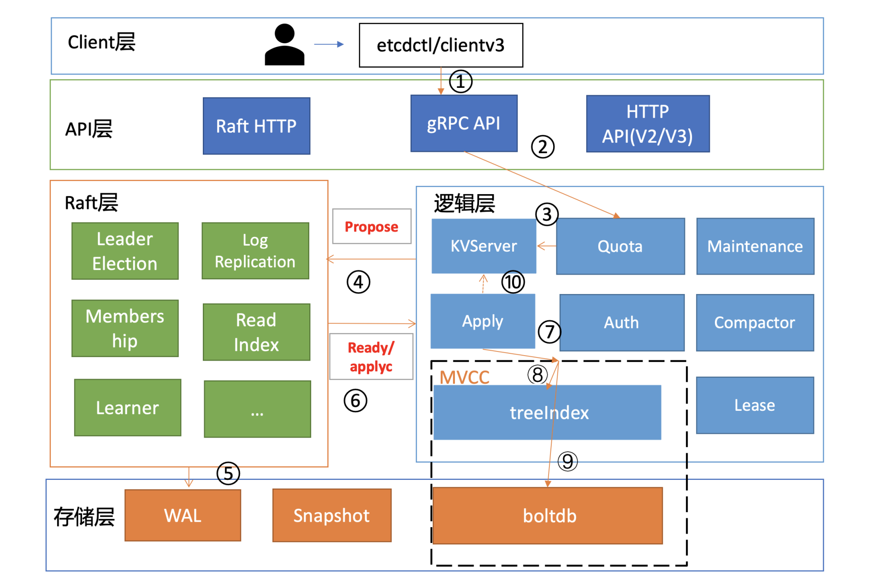
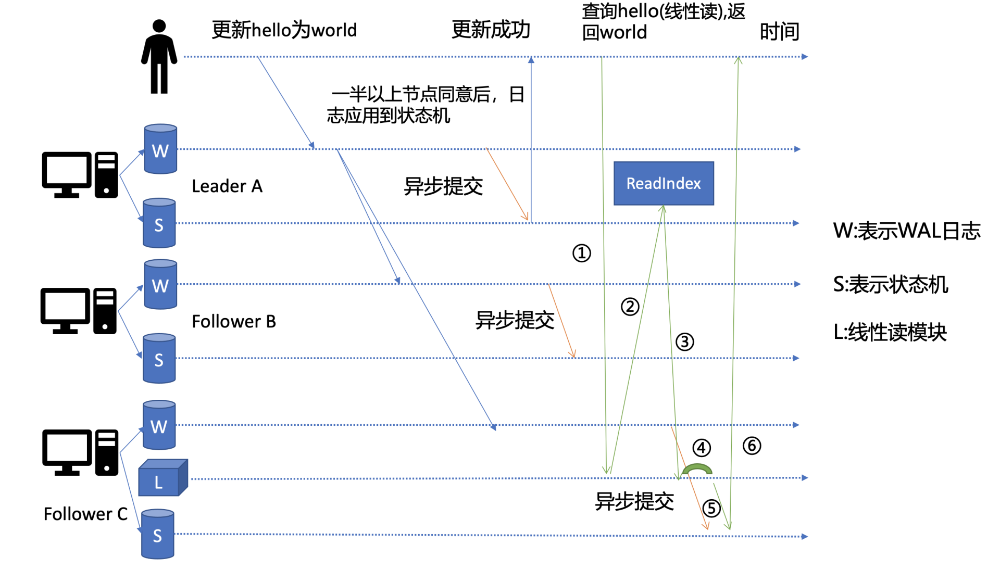
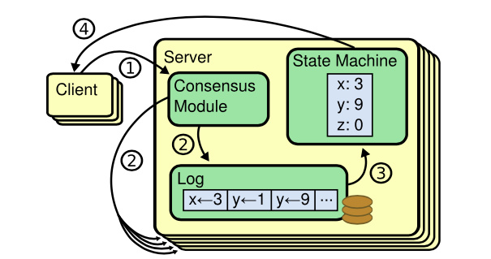
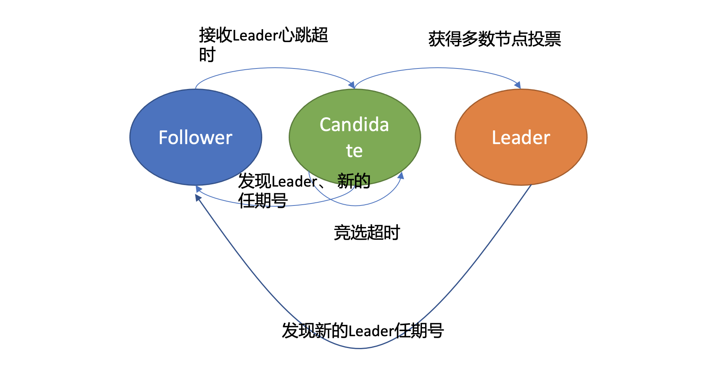
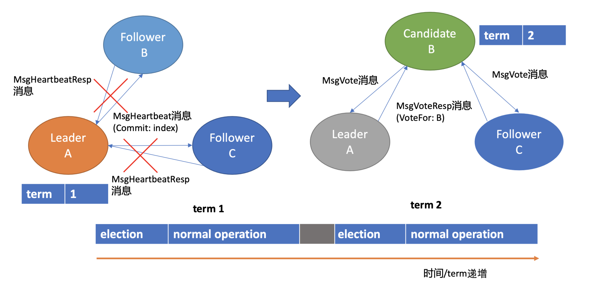
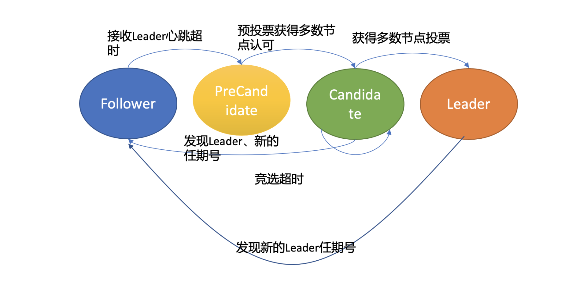
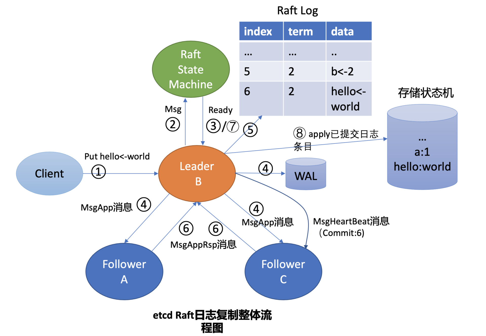
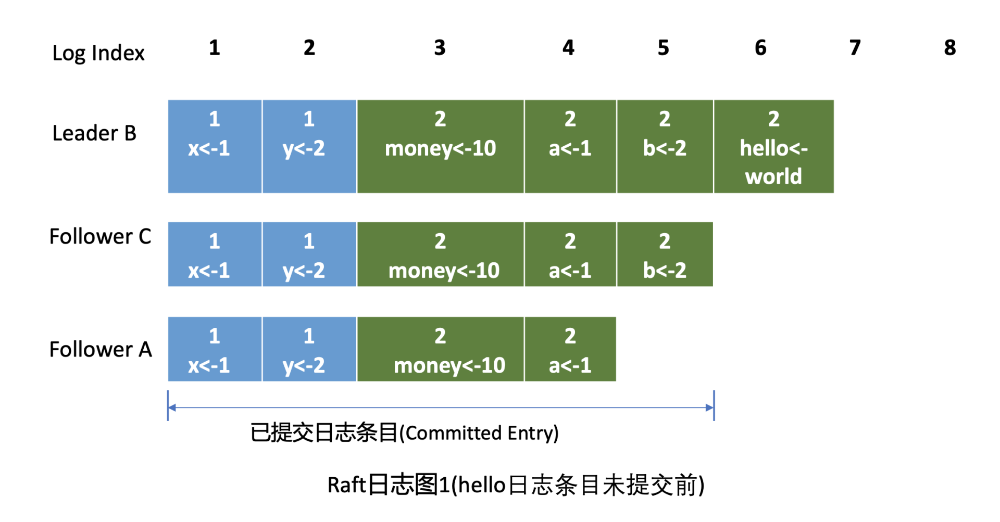
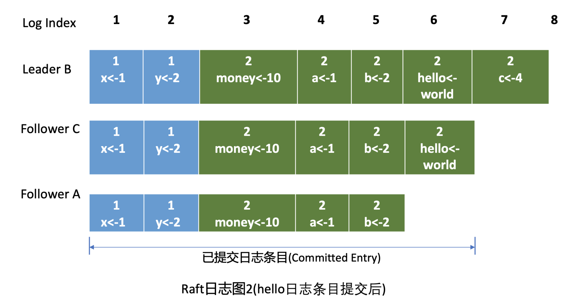
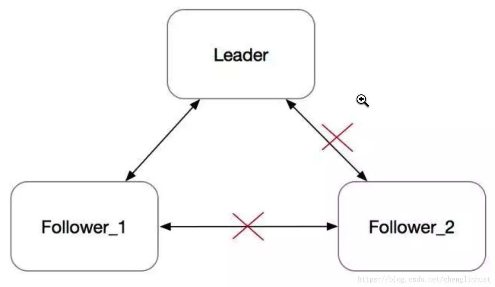

# raft协议

### 回顾

------

#### 写请求过程

1. Quota 模块工作原理和我们熟悉的 database space exceeded 错误触发原因，写请求导致 db 大小增加、compact 策略不合理、boltdb Bug 等都会导致 db 大小超限。

2. WAL 模块的存储结构，它由一条条记录顺序写入组成，每个记录含有 Type、CRC、Data，每个提案被提交前都会被持久化到 WAL 文件中，以保证集群的一致性和可恢复性。

3. Apply 模块基于 consistent index 和事务实现了幂等性，保证了节点在异常情况下不会重复执行重放的提案。

4. MVCC 模块是如何维护索引版本号、重启后如何从 boltdb 模块中获取内存索引结构的。以及 etcd 通过异步、批量提交事务机制，以提升写 QPS 和吞吐量。

通过以上介绍，希望对 etcd 的一个写语句执行流程有个初步的理解，明白 WAL 模块、Apply 模块、MVCC 模块三者是如何相互协作的，从而实现在节点遭遇 crash 等异常情况下，不丢任何已提交的数据、不重复执行任何提案。

#### 读请求过程

一个读请求从 client 通过 Round-robin 负载均衡算法，选择一个 etcd server 节点，发出 gRPC 请求，经过 etcd server 的 KVServer 模块、线性读模块、MVCC 的 treeIndex 和 boltdb 模块紧密协作，完成了一个读请求。

特别总结下 client 的节点故障自动转移和线性读。

- client 的通过负载均衡、错误处理等机制实现了 etcd 节点之间的故障的自动转移，它可助你的业务实现服务高可用，建议使用 etcd 3.4 分支的 client 版本。

- 详细解释了 etcd 提供的两种读机制 (串行读和线性读) 原理和应用场景。通过线性读，对业务而言，访问多个节点的 etcd 集群就如访问一个节点一样简单，能简洁、快速的获取到集群最新共识数据。

早期 etcd 线性读使用的 Raft log read，也就是说把读请求像写请求一样走一遍 Raft 的协议，基于 Raft 的日志的有序性，实现线性读。但此方案读涉及磁盘 IO 开销，性能较差，后来实现了 ReadIndex 读机制来提升读性能，满足了 Kubernetes 等业务的诉求。

-----

### 上期问题

1.频繁选举问题 raft中解释

2.wal会不会写磁盘：会

3.mvcc revision细节：分为全局版本号和事务局部版本号

4.二阶段和三阶段提交的区别 待查

5.Lease过期/续期  下期解释

-----

etcd 在遇到 Leader 节点 crash 等异常后，Follower 节点如何快速感知到异常，并高效选举出新的 Leader，对外提供高可用服务的。

介绍 etcd 如何保障各节点数据一致性，并介绍 Raft 算法为了确保数据一致性、完整性，对 Leader 选举和日志复制所增加的一系列安全规则。

### 如何避免单点故障

为了解决单点问题，软件系统工程师引入了数据复制技术，实现多副本。通过数据复制方案，一方面我们可以提高服务可用性，避免单点故障。另一方面，多副本可以提升读吞吐量、甚至就近部署在业务所在的地理位置，降低访问延迟。

#### 多副本复制是如何实现的呢？

- **全同步复制**是指主收到一个写请求后，必须等待全部从节点确认返回后，才能返回给客户端成功。因此如果一个从节点故障，整个系统就会不可用。这种方案为了保证多副本的一致性，而牺牲了可用性，一般使用不多。
- **异步复制**是指主收到一个写请求后，可及时返回给 client，异步将请求转发给各个副本，若还未将请求转发到副本前就故障了，则可能导致数据丢失，但是可用性是最高的。
- **半同步复制**介于全同步复制、异步复制之间，它是指主收到一个写请求后，至少有一个副本接收数据后，就可以返回给客户端成功，在数据一致性、可用性上实现了平衡和取舍。
- 跟主从复制相反的就是**去中心化复制**，它是指在一个 n 副本节点集群中，任意节点都可接受写请求，但一个成功的写入需要 w 个节点确认，读取也必须查询至少 r 个节点。

#### 如何解决以上复制算法的困境呢？

复制状态机的结构（引用自 Raft paper）， 它由共识模块、日志模块、状态机组成。通过共识模块保证各个节点日志的一致性，然后各个节点基于同样的日志、顺序执行指令，最终各个复制状态机的结果实现一致。

共识算法的祖师爷是 Paxos， 但是由于它过于复杂，难于理解，工程实践上也较难落地，导致在工程界落地较慢。

Raft 算法正是为了可理解性、易实现而诞生的，它通过问题分解，将复杂的共识问题拆分成三个子问题，分别是：

- **Leader 选举**，Leader 故障后集群能快速选出新 Leader；
- **日志复制**， 集群只有 Leader 能写入日志， Leader 负责复制日志到 Follower 节点，并强制 Follower 节点与自己保持相同；
- **安全性**，一个任期内集群只能产生一个 Leader、已提交的日志条目在发生 Leader 选举时，一定会存在更高任期的新 Leader 日志中、各个节点的状态机应用的任意位置的日志条目内容应一样等。

**节点状态：**

- Follower，跟随者， 同步从 Leader 收到的日志，etcd 启动的时候默认为此状态；
- Candidate，竞选者，可以发起 Leader 选举；
- Leader，集群领导者， 唯一性，拥有同步日志的特权，需定时广播心跳给 Follower 节点，以维持领导者身份。

上图是节点状态变化关系图，当 Follower 节点接收 Leader 节点心跳消息超时后，它会转变成 Candidate 节点，并可发起竞选 Leader 投票，若获得集群多数节点的支持后，它就可转变成 Leader 节点。

下面我以 Leader crash 场景为案例，给你详细介绍一下 etcd Leader 选举原理。

假设集群总共 3 个节点，A 节点为 Leader，B、C 节点为 Follower。

如上 Leader 选举图左边部分所示， 正常情况下，Leader 节点会按照心跳间隔时间**，定时广播心跳消息**（MsgHeartbeat 消息）给 Follower 节点，以维持 Leader 身份。 Follower 收到后回复心跳应答包消息（MsgHeartbeatResp 消息）给 Leader。

 Raft 将时间划分成一个个任期，任期用连续的整数表示，每个任期从一次选举开始，赢得选举的节点在该任期内充当 Leader 的职责，随着时间的消逝，集群可能会发生新的选举，任期号也会单调递增。

**通过任期号，可以比较各个节点的数据新旧、识别过期的 Leader 等，它在 Raft 算法中充当逻辑时钟，发挥着重要作用。**

了解完正常情况下 Leader 维持身份的原理后，我们再看异常情况下，也就是 **Leader crash 后，etcd 是如何自愈的**呢？

如上 Leader 选举图右边部分所示，当 Leader 节点异常后，Follower 节点会接收 Leader 的心跳消息超时，当超时时间大于竞选超时时间后，它们会进入 Candidate 状态。

etcd 默认心跳间隔时间（heartbeat-interval）是 100ms， 默认竞选超时时间（election timeout）是 1000ms， 你需要根据实际部署环境、业务场景适当调优，否则就很可能会频繁发生 Leader 选举切换，导致服务稳定性下降。

进入 Candidate 状态的节点，会立即发起选举流程，自增任期号，投票给自己，并向其他节点发送竞选 Leader 投票消息（MsgVote）。

C 节点收到 Follower B 节点竞选 Leader 消息后，这时候可能会出现如下两种情况：

- 第一种情况是 C 节点判断 B 节点的数据至少和自己一样新、B 节点任期号大于 C 当前任期号、并且 C 未投票给其他候选者，就可投票给 B。这时 B 节点获得了集群多数节点支持，于是成为了新的 Leader。

- 第二种情况是，恰好 C 也心跳超时超过竞选时间了，它也发起了选举，并投票给了自己，那么它将拒绝投票给 B，这时谁也无法获取集群多数派支持，只能等待竞选超时，开启新一轮选举。Raft 为了优化选票被瓜分导致选举失败的问题，引入了随机数，每个节点等待发起选举的时间点不一致，优雅的解决了潜在的竞选活锁，同时易于理解。

Leader 选出来后，它什么时候又会变成 Follower 状态呢？ 从上面的状态转换关系图中你可以看到，如果现有 Leader 发现了新的 Leader 任期号，那么它就需要转换到 Follower 节点。A 节点 crash 后，再次启动成为 Follower，假设因为网络问题无法连通 B、C 节点，这时候根据状态图，我们知道它将不停自增任期号，发起选举。等 A 节点网络异常恢复后，那么现有 Leader 收到了新的任期号，就会触发新一轮 Leader 选举，影响服务的可用性。

然而 A 节点的数据是远远落后 B、C 的，是无法获得集群 Leader 地位的，发起的选举无效且对集群稳定性有伤害。

**如果避免上面说的无效选举？**

在 etcd 3.4 中，etcd 引入了一个 PreVote 参数（默认 false），可以用来启用 PreCandidate 状态解决此问题，如下图所示。Follower 在转换成 Candidate 状态前，先进入 PreCandidate 状态，不自增任期号， 发起预投票。若获得集群多数节点认可，确定有概率成为 Leader 才能进入 Candidate 状态，发起选举流程。

这就是 Raft Leader 选举核心原理，使用心跳机制维持 Leader 身份、触发 Leader 选举，etcd 基于它实现了高可用，只要集群一半以上节点存活、可相互通信，Leader 宕机后，就能快速选举出新的 Leader，继续对外提供服务。

### 日志复制

假设在上面的 Leader 选举流程中，B 成为了新的 Leader，它收到 put 提案后，它是如何将日志同步给 Follower 节点的呢？ 什么时候它可以确定一个日志条目为已提交，通知 etcdserver 模块应用日志条目指令到状态机呢？

首先 Leader 收到 client 的请求后，etcdserver 的 KV 模块会向 Raft 模块提交一个 put hello 为 world 提案消息（流程图中的序号 2 流程），  它的消息类型是 MsgProp。

Leader 的 Raft 模块获取到 MsgProp 提案消息后，为此提案生成一个日志条目，追加到未持久化、**不稳定的 Raft 日志**中，随后会遍历集群 Follower 列表和进度信息，为每个 Follower 生成追加（MsgApp）类型的 RPC 消息，此消息中包含待复制给 Follower 的日志条目。

这里就出现两个疑问了。第一，Leader 是如何知道从哪个索引位置发送日志条目给 Follower，以及 Follower 已复制的日志最大索引是多少呢？第二，日志条目什么时候才会追加到稳定的 Raft 日志中呢？Raft 模块负责持久化吗？

Leader 会维护两个核心字段来追踪各个 Follower 的进度信息，一个字段是 NextIndex， 它表示 Leader 发送给 Follower 节点的下一个日志条目索引。一个字段是 MatchIndex， 它表示 Follower 节点已复制的最大日志条目的索引，比如上面的日志图 1 中 C 节点的已复制最大日志条目索引为 5，A 节点为 4。

上层应用通过 Raft 模块的输出接口（如 Ready 结构），获取到待持久化的日志条目和待发送给 Peer 节点的消息后（如上面的 MsgApp 日志消息），需持久化日志条目到自定义的 WAL 模块，通过自定义的网络模块将消息发送给 Peer 节点。

日志条目持久化到稳定存储中后，这时候你就可以将日志条目追加到稳定的 Raft 日志中。即便这个日志是内存存储，节点重启时也不会丢失任何日志条目，因为 WAL 模块已持久化此日志条目，可通过它重建 Raft 日志。

正如刚刚讲到的，Raft 模块输入是 Msg 消息，输出是一个 Ready 结构，它包含待持久化的日志条目、发送给 peer 节点的消息、已提交的日志条目内容、线性查询结果等 Raft 输出核心信息。

**etcdserver 模块通过 channel 从 Raft 模块获取到 Ready 结构后（流程图中的序号 3 流程），因 B 节点是 Leader，它首先会通过基于 HTTP 协议的网络模块将追加日志条目消息（MsgApp）广播给 Follower，并同时将待持久化的日志条目持久化到 WAL 文件中（流程图中的序号 4 流程），最后将日志条目追加到稳定的 Raft 日志存储中（流程图中的序号 5 流程）。**

各个 Follower 收到追加日志条目（MsgApp）消息，并通过安全检查后，它会持久化消息到 WAL 日志中，并将消息追加到 Raft 日志存储，随后会向 Leader 回复一个应答追加日志条目（MsgAppResp）的消息，告知 Leader 当前已复制的日志最大索引（流程图中的序号 6 流程）。

最后 Leader 根据 Follower 的 MatchIndex 信息，计算出一个位置，如果这个位置已经被一半以上节点持久化，那么这个位置之前的日志条目都可以被标记为已提交。

最后各个节点的 etcdserver 模块，可通过 channel 从 Raft 模块获取到已提交的日志条目（流程图中的序号 7 流程），应用日志条目内容到存储状态机（流程图中的序号 8 流程），返回结果给 client。

通过以上流程，Leader 就完成了同步日志条目给 Follower 的任务，一个日志条目被确定为已提交的前提是，它需要被 Leader 同步到一半以上节点上。以上就是 etcd Raft 日志复制的核心原理。

### 安全性

如果在上面的日志图 2 中，Leader B 在应用日志指令 put hello 为 world 到状态机，并返回给 client 成功后，突然 crash 了，那么 Follower A 和 C 是否都有资格选举成为 Leader 呢？

从日志图 2 中我们可以看到，如果 A 成为了 Leader 那么就会导致数据丢失，因为它并未含有刚刚 client 已经写入成功的 put hello 为 world 指令。

Raft 算法如何确保面对这类问题时不丢数据和各节点数据一致性呢？

这就是 Raft 的第三个子问题需要解决的。Raft 通过给选举和日志复制增加一系列规则，来实现 Raft 算法的安全性。

#### 选举规则

当节点收到选举投票的时候，需检查候选者的最后一条日志中的任期号，若小于自己则拒绝投票。如果任期号相同，日志却比自己短，也拒绝为其投票。

比如在日志图 2 中，Folllower A 和 C 任期号相同，但是 Follower C 的数据比 Follower A 要长，那么在选举的时候，Follower C 将拒绝投票给 A， 因为它的数据不是最新的。

同时，对于一个给定的任期号，最多只会有一个 leader 被选举出来，leader 的诞生需获得集群一半以上的节点支持。每个节点在同一个任期内只能为一个节点投票，节点需要将投票信息持久化，防止异常重启后再投票给其他节点。

通过以上规则就可防止日志图 2 中的 Follower A 节点成为 Leader。

#### 日志复制规则

在日志图 2 中，Leader B 返回给 client 成功后若突然 crash 了，此时可能还并未将 6 号日志条目已提交的消息通知到 Follower A 和 C，那么如何确保 6 号日志条目不被新 Leader 删除呢？ 同时在 etcd 集群运行过程中，Leader 节点若频繁发生 crash 后，可能会导致 Follower 节点与 Leader 节点日志条目冲突，如何保证各个节点的同 Raft 日志位置含有同样的日志条目？

以上各类异常场景的安全性是通过 Raft 算法中的 **Leader 完全特性和只附加原则、日志匹配等安全机制**来保证的。

**Leader 完全特性**是指如果某个日志条目在某个任期号中已经被提交，那么这个条目必然出现在更大任期号的所有 Leader 中。

Leader 只能追加日志条目，不能删除已持久化的日志条目（**只附加原则**），因此 Follower C 成为新 Leader 后，会将前任的 6 号日志条目复制到 A 节点。

为了保证各个节点日志一致性，Raft 算法在追加日志的时候，引入了一致性检查。Leader 在发送追加日志 RPC 消息时，会把新的日志条目紧接着之前的条目的索引位置和任期号包含在里面。Follower 节点会检查相同索引位置的任期号是否与 Leader 一致，一致才能追加，这就是**日志匹配特性**。它本质上是一种归纳法，一开始日志空满足匹配特性，随后每增加一个日志条目时，都要求上一个日志条目信息与 Leader 一致，那么最终整个日志集肯定是一致的。

### 小结

从如何避免单点故障说起，给你介绍了分布式系统中实现多副本技术的一系列方案，从主从复制到去中心化复制、再到状态机、共识算法，让你了解了各个方案的优缺点，以及主流存储产品的选择。

raft将一个复杂问题拆分成三个子问题，分别是 Leader 选举、日志复制和安全性。

Raft 日志复制确保了 etcd 多节点间的数据一致性，通过一个 etcd 日志复制整体流程图为你详细介绍了 etcd 写请求从提交到 Raft 模块，到被应用到状态机执行的各个流程，剖析了日志复制的核心原理，即一个日志条目只有被 Leader 同步到一半以上节点上，此日志条目才能称之为成功复制、已提交。Raft 的安全性，通过对 Leader 选举和日志复制增加一系列规则，保证了整个集群的一致性、完整性。

动画演示：http://www.kailing.pub/raft/index.html

------

遗留问题：

- **预选过程**

- **论文中是否有预投票**

  

### 背景

Follower_2在electionTimeout没收到心跳之后,会发起选举，并转为Candidate。每次发起选举时，会把Term加一。由于网络隔离，它既不会被选成Leader，也不会收到Leader的消息，而是会一直不断地发起选举。Term会不断增大。

一段时间之后，这个节点的Term会非常大。在网络恢复之后，这个节点会把它的Term传播到集群的其他节点，导致其他节点更新自己的term，变为Follower。然后触发重新选主，但这个旧的Follower_2节点由于其日志不是最新，并不会成为Leader。整个集群被这个网络隔离过的旧节点扰乱，显然需要避免的。

### 大致思路

Raft作者博士论文《**CONSENSUS: BRIDGING THEORY AND PRACTICE**》的第9.6节 "Preventing disruptions when a server rejoins the cluster"提到了PreVote算法的大概实现思路。

在PreVote算法中，Candidate首先要确认自己能赢得集群中大多数节点的投票，这样才会把自己的term增加，然后发起真正的投票。其他投票节点同意发起选举的条件是（同时满足下面两个条件）：

- 没有收到有效领导的心跳，至少有一次选举超时。
- Candidate的日志足够新（Term更大，或者Term相同raft index更大）。

PreVote算法解决了网络分区节点在重新加入时，会中断集群的问题。在PreVote算法中，网络分区节点由于无法获得大部分节点的许可，因此无法增加其Term。然后当它重新加入集群时，它仍然无法递增其Term，因为其他服务器将一直收到来自Leader节点的定期心跳信息。一旦该服务器从领导者接收到心跳，它将返回到Follower状态，Term和Leader一致。

Prevote是一个典型的2PC协议，第一阶段先征求其他节点是否同意选举，如果同意选举则发起真正的选举操作，否则降为Follower角色。这样就避免了网络分区节点重新加入集群，触发不必要的选举操作。