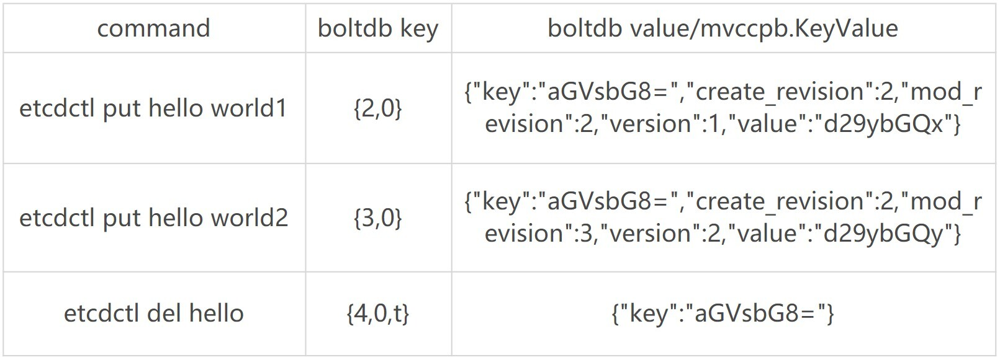

# MVCC：如何实现多版本并发控制？


目标：搞懂 MVCC 含义和 MVCC 机制下 key-value 数据的更新、查询、删除原理，了解 treeIndex 索引模块、boltdb 模块是如何相互协作，实现保存一个 key-value 数据多个历史版本。

### 什么是MVCC

是一个基于多版本技术实现的一种并发控制机制。

常见的并发控制机制，比如数据库中的悲观锁，也就是通过锁机制确保同一时刻只能有一个事务对数据进行修改操作，常见的实现方案有读写锁、互斥锁、两阶段锁等。

**MVCC 机制正是基于多版本技术实现的一种乐观锁机制**，它乐观地认为数据不会发生冲突，但是当事务提交时，具备检测数据是否冲突的能力。

在 MVCC 数据库中，你更新一个 key-value 数据的时候，它并不会直接覆盖原数据，而是新增一个版本来存储新的数据，每个数据都有一个版本号。**版本号是一个逻辑时间**

**当你指定版本号读取数据时，它实际上访问的是版本号生成那个时间点的快照数据。**当你删除数据的时候，它实际也是新增一条带删除标识的数据记录。


### 整体架构


Apply 模块通过 MVCC 模块来执行 put 请求，持久化 key-value 数据。MVCC 模块将请求请划分成两个类别，分别是读事务（ReadTxn）和写事务（WriteTxn）。读事务负责处理 range 请求，写事务负责 put/delete 操作。读写事务基于 treeIndex、Backend/boltdb 提供的能力，实现对 key-value 的增删改查功能。

**treeIndex 模块基于内存版 B-tree 实现了 key 索引管理**，它保存了用户 key 与版本号（revision）的映射关系等信息。

Backend 模块负责 etcd 的 key-value 持久化存储，ReadTx 定义了抽象的读事务接口，BatchTx 在 ReadTx 之上定义了抽象的写事务接口，Buffer 是数据缓存区。

etcd 设计上支持多种 Backend 实现，目前实现的 Backend 是 boltdb。boltdb 是一个基于 B+ tree 实现的、支持事务的 key-value 嵌入式数据库。

treeIndex 与 boltdb 关系可参考下图。


#### treeIndex 原理

对于 etcd v2 来说，当你通过 etcdctl 发起一个 put hello 操作时，etcd v2 直接更新内存树，这就导致历史版本直接被覆盖，无法支持保存 key 的历史版本。在 etcd v3 中引入 treeIndex 模块正是为了解决这个问题，支持保存 key 的历史版本，提供稳定的 Watch 机制和事务隔离等能力。

etcd 在每次修改 key 时会生成一个全局递增的版本号（revision），然后通过数据结构 B-tree 保存用户 key 与版本号之间的关系，再以版本号作为 boltdb key，以用户的 key-value 等信息作为 boltdb value，保存到 boltdb。

**为什么 不使用哈希表、平衡二叉树？**

- 从 etcd 的功能特性上分析， 因 etcd 支持范围查询，因此保存索引的数据结构也必须支持范围查询才行。所以哈希表不适合，而 B-tree 支持范围查询。
- 从性能上分析，平横二叉树每个节点只能容纳一个数据、导致树的高度较高，而 B-tree 每个节点可以容纳多个数据，树的高度更低，更扁平，涉及的查找次数更少，具有优越的增、删、改、查性能。


下图是个最大度（degree > 1，简称 d）为 5 的 B-tree，度是 B-tree 中的一个核心参数，它决定了你每个节点上的数据量多少、节点的“胖”、“瘦”程度。


仅需通过图中流程 1 和 2 两次快速比较，就可快速找到 k95 所在的节点。

```go
type keyIndex struct {
   key         []byte //用户的key名称，比如我们案例中的"hello"
   modified    revision //最后一次修改key时的etcd版本号,比如我们案例中的刚写入hello为world1时的，版本号为2
   generations []generation //generation保存了一个key若干代版本号信息，每代中包含对key的多次修改的版本号列表
}
```

```go
type generation struct {
   ver     int64    //表示此key的修改次数
   created revision //表示generation结构创建时的版本号
   revs    []revision //每次修改key时的revision追加到此数组
}
```

```go
type revision struct {
   main int64    // 一个全局递增的主版本号，随put/txn/delete事务递增，一个事务内的key main版本号是一致的
   sub int64    // 一个事务内的子版本号，从0开始随事务内put/delete操作递增
}
```

revision 包含 main 和 sub 两个字段，main 是全局递增的版本号，它是个 etcd 逻辑时钟，随着 put/txn/delete 等事务递增。sub 是一个事务内的子版本号，从 0 开始随事务内的 put/delete 操作递增。

比如启动一个空集群，全局版本号默认为 1，执行下面的 txn 事务，它包含两次 put、一次 get 操作，那么按照我们上面介绍的原理，全局版本号随读写事务自增，因此是 main 为 2，sub 随事务内的 put/delete 操作递增，因此 key hello 的 revison 为{2,0}，key world 的 revision 为{2,1}。

```shell
$ etcdctl txn -i
compares:

success requests (get，put，del):
put hello 1
get hello
put world 2
```


### MVCC 更新 key 原理


含义分别如下：

- create_revision 表示此 key 创建时的版本号。在我们的案例中，key hello 是第一次创建，那么值就是 2。当你再次修改 key hello 的时候，写事务会从 treeIndex 模块查询 hello 第一次创建的版本号，也就是 keyIndex.generations[i].created 字段，赋值给 create_revision 字段；
- mod_revision 表示 key 最后一次修改时的版本号，即 put 操作发生时的全局版本号加 1；
- version 表示此 key 的修改次数。每次修改的时候，写事务会从 treeIndex 模块查询 hello 已经历过的修改次数，也就是 keyIndex.generations[i].ver 字段，将 ver 字段值加 1 后，赋值给 version 字段。

填充好 boltdb 的 KeyValue 结构体后，这时就可以通过 Backend 的写事务 batchTx 接口将 key{2,0},value 为 mvccpb.KeyValue 保存到 boltdb 的缓存中，并同步更新 buffer，

此时存储到 boltdb 中的 key、value 数据如下：


keyIndex 填充后的结果如下所示：

```go
key hello的keyIndex:
key:     "hello"
modified: <2,0>
generations:
[{ver:1,created:<2,0>,revisions: [<2,0>]} ]
```

- key 为 hello，modified 为最后一次修改版本号 <2,0>，key hello 是首次创建的，因此新增一个 generation 代跟踪它的生命周期、修改记录；
- generation 的 ver 表示修改次数，首次创建为 1，后续随着修改操作递增；
- generation.created 表示创建 generation 时的版本号为 <2,0>；
- revision 数组保存对此 key 修改的版本号列表，每次修改都会将将相应的版本号追加到 revisions 数组中。

为了提升 etcd 的写吞吐量、性能，通过事务批量提交，定时将 boltdb 页缓存中的脏数据提交到持久化存储磁盘中。

#### MVCC 查询 key 原理

并发读特性的核心原理是创建读事务对象时，它会全量拷贝当前写事务未提交的 buffer 数据，并发的读写事务不再阻塞在一个 buffer 资源锁上，实现了全并发读。


首先需要根据 key 从 treeIndex 模块获取版本号，因我们未带版本号读，默认是读取最新的数据。treeIndex 模块从 B-tree 中，根据 key 查找到 keyIndex 对象后，匹配有效的 generation，返回 generation 的 revisions 数组中最后一个版本号{2,0}给读事务对象。

读事务对象根据此版本号为 key，通过 Backend 的并发读事务（ConcurrentReadTx）接口，优先从 buffer 中查询，命中则直接返回，否则从 boltdb 中查询此 key 的 value 信息。

当你再次发起一个 put hello 为 world2 修改操作时，key hello 对应的 keyIndex 的结果如下面所示，keyIndex.modified 字段更新为 <3,0>，generation 的 revision 数组追加最新的版本号 <3,0>，ver 修改为 2。

```go

key hello的keyIndex:
key:     "hello"
modified: <3,0>
generations:
[{ver:2,created:<2,0>,revisions: [<2,0>,<3,0>]}]
```

boltdb 插入一个新的 key revision{3,0}，此时存储到 boltdb 中的 key-value 数据如下：


这时你再发起一个指定历史版本号为 2 的读请求时，实际是读版本号为 2 的时间点的快照数据。treeIndex 模块会遍历 generation 内的历史版本号，返回小于等于 2 的最大历史版本号，在我们这个案例中，也就是 revision{2,0}，以它作为 boltdb 的 key，从 boltdb 中查询出 value 即可。

### MVCC 删除 key 原理

与更新 key 不一样之处在于，一方面，生成的 boltdb key 版本号{4,0,t}追加了删除标识（tombstone, 简写 t），boltdb value 变成只含用户 key 的 KeyValue 结构体。另一方面 treeIndex 模块也会给此 key hello 对应的 keyIndex 对象，追加一个空的 generation 对象，表示此索引对应的 key 被删除了。

当你再次查询 hello 的时候，treeIndex 模块根据 key hello 查找到 keyindex 对象后，若发现其存在空的 generation 对象，并且查询的版本号大于等于被删除时的版本号，则会返回空。

```go

key hello的keyIndex:
key:     "hello"
modified: <4,0>
generations:
[
{ver:3,created:<2,0>,revisions: [<2,0>,<3,0>,<4,0>(t)]}，             
{empty}
]
```

boltdb 此时会插入一个新的 key revision{4,0,t}，此时存储到 boltdb 中的 key-value 数据如下：



- 一方面删除 key 时会生成 events，Watch 模块根据 key 的删除标识，会生成对应的 Delete 事件。
- 另一方面，当你重启 etcd，遍历 boltdb 中的 key 构建 treeIndex 内存树时，你需要知道哪些 key 是已经被删除的，并为对应的 key 索引生成 tombstone 标识。而真正删除 treeIndex 中的索引对象、boltdb 中的 key 是通过压缩 (compactor) 组件异步完成。

正因为 etcd 的删除 key 操作是基于以上延期删除原理实现的，因此只要压缩组件未回收历史版本，我们就能从 etcd 中找回误删的数据。

### 小结

treeIndex 模块基于 Google 开源的 btree 库实现，它的核心数据结构 keyIndex，保存了用户 key 与版本号关系。每次修改 key 都会生成新的版本号，生成新的 boltdb key-value。boltdb 的 key 为版本号，value 包含用户 key-value、各种版本号、lease 的 mvccpb.KeyValue 结构体。

当你未带版本号查询 key 时，etcd 返回的是 key 最新版本数据。当你指定版本号读取数据时，etcd 实际上返回的是版本号生成那个时间点的快照数据。

删除一个数据时，etcd 并未真正删除它，而是基于 lazy delete 实现的异步删除。删除原理本质上与更新操作类似，只不过 boltdb 的 key 会打上删除标记，keyIndex 索引中追加空的 generation。真正删除 key 是通过 etcd 的压缩组件去异步实现的，在后面的课程里我会继续和你深入介绍。

基于以上原理特性的实现，etcd 实现了保存 key 历史版本的功能，是高可靠 Watch 机制的基础。基于 key-value 中的各种版本号信息，etcd 可提供各种级别的简易事务隔离能力。基于 Backend/boltdb 提供的 MVCC 机制，etcd 可实现读写不冲突。