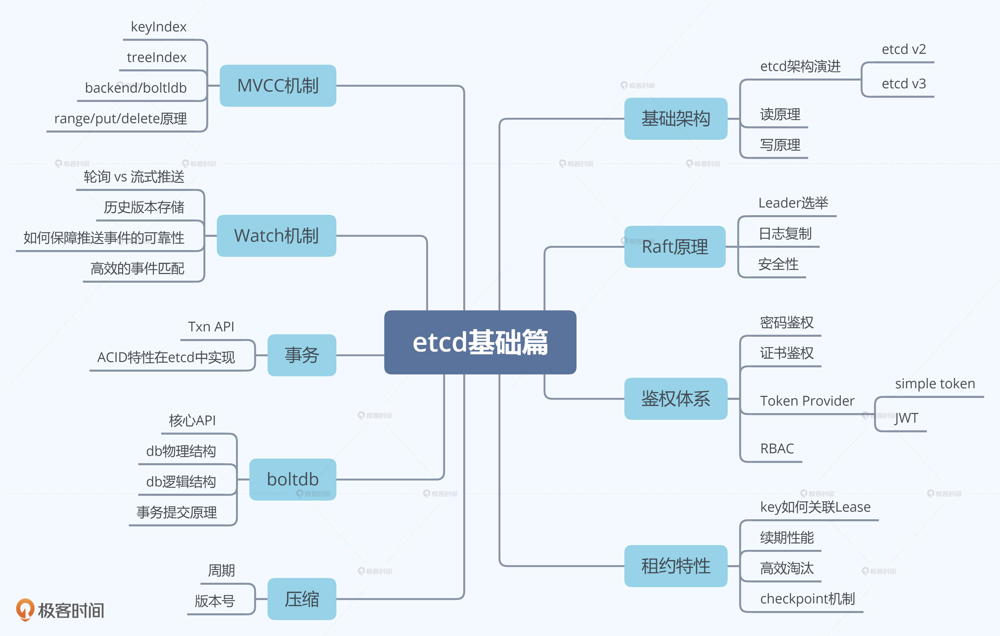
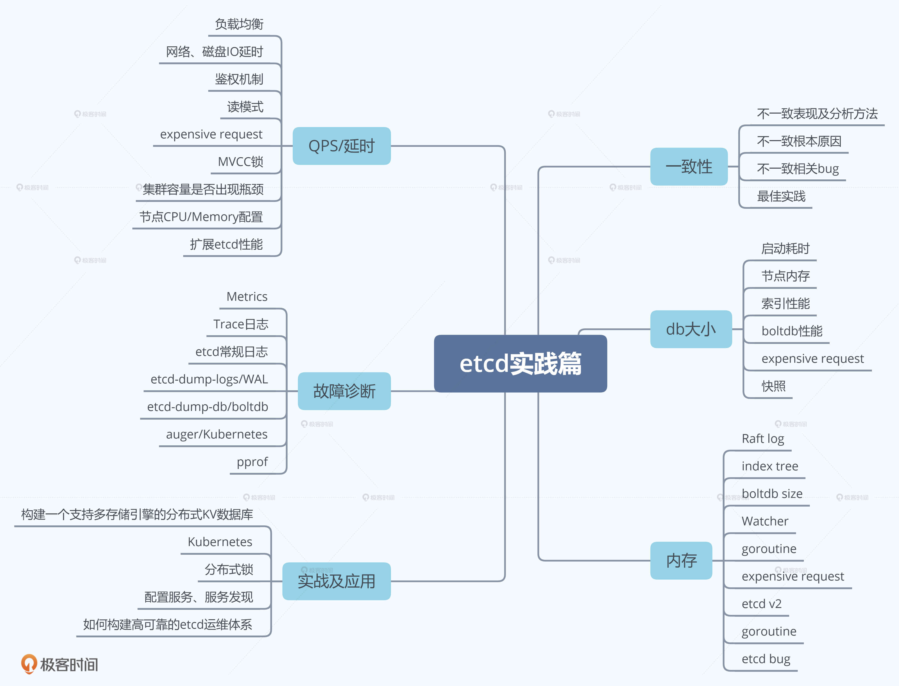

# etcd
etce学习笔记整理

etcd 学习其实可以分为大中小三个目标。最大的目标我当然是希望你能够用最低的学习成本，掌握 etcd 核心原理与最佳实践，让 etcd 为你所用，帮助你解决业务过程中的各类痛点，在工作中少踩坑、少交学费，多升职、多涨薪。

首先，你能知道什么是 etcd，了解它的基本读写原理、核心特性和能解决什么问题。

然后，在使用 etcd 解决各类业务场景需求时，能独立判断 etcd 是否适合你的业务场景，并能设计出良好的存储结构，避免 expensive request。

其次，在使用 Kubernetes 的过程中，你能清晰地知道你的每个操作背后的 etcd 是如何工作的，并遵循 Kubernetes/etcd 最佳实践，让你的 Kubernetes 集群跑得更快更稳。

接着，在运维 etcd 集群的时候，你能知道 etcd 集群核心监控指标，了解常见的坑，制定良好的巡检、监控策略，及时发现、规避问题，避免事故的产生。

最后，当你遇到 etcd 问题时，能自己分析为什么会出现这样的错误，并知道如何解决，甚至给社区提 PR 优化，做到知其然知其所以然。

etcd 基础架构。通过为你梳理 etcd 前世今生、分析 etcd 读写流程，帮助你建立起对 etcd 的整体认知，了解一个分布式存储系统的基本模型、设计思想。
Raft 算法。通过为你介绍 Raft 算法在 etcd 中是如何工作的，帮助你了解 etcd 高可用、高可靠背后的核心原理。
鉴权模块。通过介绍 etcd 的鉴权、授权体系，带你了解 etcd 是如何保护你的数据安全，以及各个鉴权机制的优缺点。
租约模块。介绍 etcd 租约特性的实现，帮助你搞懂如何检测一个进程的存活性，为什么它可以用于 Leader 选举中。
MVCC/Watch 模块。通过这两个模块帮助你搞懂 Kubernetes 控制器编程模型背后的原理。

问题篇。为你分析 etcd 使用过程中的各类典型问题，和你细聊各种异常现象背后的原理、最佳实践。
性能优化篇。通过读写链路的分析，为你梳理可能影响 etcd 性能的每一个瓶颈。
实战篇。带你从 0 到 1 亲手参与构建一个简易的分布式 KV 数据库，进一步提升你对分布式存储系统的认知。
Kubernetes 实践篇。为你分析 etcd 在 Kubernetes 中的应用，让你对 Kubernetes 原理有更深层次的理解。
etcd 应用篇。介绍 etcd 在分布式锁、配置系统、服务发现场景中的应用。

