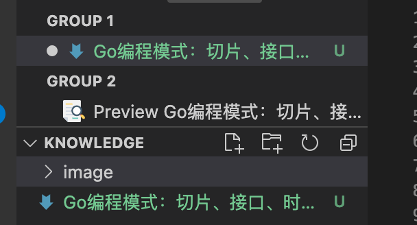

### Slice
Slice的中文名叫切片，底层是一个结构体，而不是数组，结构体定义如下：
```go
type slice struct {
    array unsafe.Pointer //指向存放数据的数组指针
    len   int            //长度有多大
    cap   int            //容量有多大
}
```
先来看一段代码


```go
foo = make([]int, 5)
foo[3] = 42
foo[4] = 100

bar  := foo[1:4]
bar[1] = 99
```
代码的意思是foo创建了一个长度为5的数组，分别对索引 为3和4的元素赋值，对foo做切片后赋值给bar，对bar[1]赋值。


结合以上图片，因为切片是共享内存的，所以两个切片修改数值会互相影响。

再来看一段代码
```go
a := make([]int, 32)
b := a[1:16]
a = append(a, 1)
a[2] = 42
```

在这段代码中，把 a[1:16] 的切片赋给 b ，此时，a 和 b 的内存空间是共享的，然后，对 a 做了一个 append()的操作，这个操作会让 a 重新分配内存，这就会导致 a 和 b 不再共享，如下图所示：


append()这个函数在 cap 不够用的时候，就会重新分配内存以扩大容量，如果够用，就不会重新分配内存了！

看以下代码：
```go
func main() {
    path := []byte("AAAA/BBBBBBBBB")
    sepIndex := bytes.IndexByte(path,'/')

    dir1 := path[:sepIndex]
    dir2 := path[sepIndex+1:]

    fmt.Println("dir1 =>",string(dir1)) //prints: dir1 => AAAA
    fmt.Println("dir2 =>",string(dir2)) //prints: dir2 => BBBBBBBBB

    dir1 = append(dir1,"suffix"...)

    fmt.Println("dir1 =>",string(dir1)) //prints: dir1 => AAAAsuffix
    fmt.Println("dir2 =>",string(dir2)) //prints: dir2 => uffixBBBB
}
```
切片dir1和dir2存在共享内存的片段，dir1对元素的修改涉及到共享内存区域，同时影响了dir2的输出内容。

如何避免以上情况呢？只需要修改一行代码，把
```
dir1 := path[:sepIndex]
```
修改为
```
dir1 := path[:sepIndex:sepIndex]
```
新的代码使用了Full Slice Expression，最后一个参数叫“Limited Capacity”，于是，后续的 append() 操作会导致重新分配内存。

### 深度比较

当我们复制一个对象时，这个对象可以是内建数据类型、数组、结构体、Map……在复制结构体的时候，如果我们需要比较两个结构体中的数据是否相同，就要使用深度比较，而不只是简单地做浅度比较。

### 接口编程

```go

type Country struct {
    Name string
}

type City struct {
    Name string
}

type Stringable interface {
    ToString() string
}
func (c Country) ToString() string {
    return "Country = " + c.Name
}
func (c City) ToString() string{
    return "City = " + c.Name
}

func PrintStr(p Stringable) {
    fmt.Println(p.ToString())
}

d1 := Country {"USA"}
d2 := City{"Los Angeles"}
PrintStr(d1)
PrintStr(d2)
```

在这段代码中，我们可以看到，我们使用了一个叫Stringable 的接口，我们用这个接口把“业务类型” Country 和 City 和“控制逻辑” Print() 给解耦了。于是，只要实现了Stringable 接口，都可以传给 PrintStr() 来使用。

这种编程模式在 Go 的标准库有很多的示例，最著名的就是 io.Read 和 ioutil.ReadAll 的玩法，其中 io.Read 是一个接口，你需要实现它的一个 Read(p []byte) (n int, err error) 接口方法，只要满足这个规则，就可以被 ioutil.ReadAll这个方法所使用。这就是面向对象编程方法的黄金法则——“Program to an interface not an implementation”。

### 接口完整性检查

以以下代码为例：

```go

type Shape interface {
    Sides() int
    Area() int
}
type Square struct {
    len int
}
func (s* Square) Sides() int {
    return 4
}
func main() {
    s := Square{len: 5}
    fmt.Printf("%d\n",s.Sides())
}
```

在 Go 语言编程圈里，有一个比较标准的做法：

```go
var _ Shape = (*Square)(nil)
```

声明一个 _ 变量（没人用）会把一个 nil 的空指针从 Square 转成 Shape，这样，如果没有实现完相关的接口方法，编译器就会报错：

```
cannot use (*Square)(nil) (type *Square) as type Shape in assignment: *Square does not implement Shape (missing Area method)
```

这样就做到了强验证的方法。


### 性能提示

如果需要把数字转换成字符串，使用 strconv.Itoa() 比 fmt.Sprintf() 要快一倍左右。

尽可能避免把String转成[]Byte ，这个转换会导致性能下降。

如果在 for-loop 里对某个 Slice 使用 append()，请先把 Slice 的容量扩充到位，这样可以避免内存重新分配以及系统自动按 2 的 N 次方幂进行扩展但又用不到的情况，从而避免浪费内存。

使用StringBuffer 或是StringBuild 来拼接字符串，性能会比使用 + 或 +=高三到四个数量级。

尽可能使用并发的 goroutine，然后使用 sync.WaitGroup 来同步分片操作
。
避免在热代码中进行内存分配，这样会导致 gc 很忙。尽可能使用  sync.Pool 来重用对象。

使用 lock-free 的操作，避免使用 mutex，尽可能使用 sync/Atomic包（关于无锁编程的相关话题，可参看《无锁队列实现》或《无锁 Hashmap 实现》）。

使用 I/O 缓冲，I/O 是个非常非常慢的操作，使用 bufio.NewWrite() 和 bufio.NewReader() 可以带来更高的性能。

对于在 for-loop 里的固定的正则表达式，一定要使用 regexp.Compile() 编译正则表达式。性能会提升两个数量级。

如果你需要更高性能的协议，就要考虑使用 protobuf 或 msgp 而不是 JSON，因为 JSON 的序列化和反序列化里使用了反射。

你在使用 Map 的时候，使用整型的 key 会比字符串的要快，因为整型比较比字符串比较要快。

(摘抄自[《Go编程模式：切片、接口、时间和性能》](https://time.geekbang.org/column/article/332600))