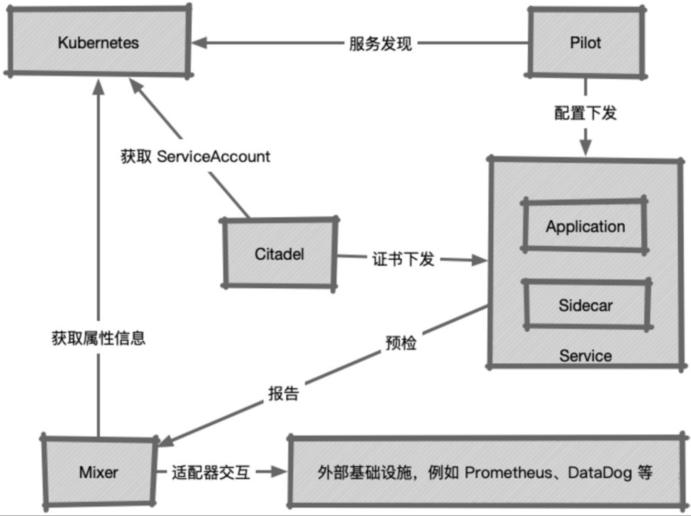
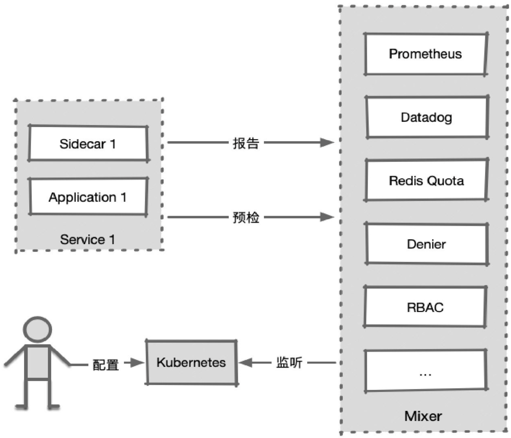

## Istio的核心组件及其功能

Istio总体来说分为两部分：控制面和数据面，如下所述。

◎ 数据面被称为“Sidecar”，可将其理解为旧式三轮摩托车的挂斗。Sidecar通过注入的方式和业务容器共存于一个Pod中，会劫持业务应用容器的流量，并接受控制面组件的控制，同时会向控制面输出日志、跟踪及监控数据。

◎ 控制面是Istio的核心，管理Istio的所有功能。

### 1.1 pilot

Pilot是Istio的主要控制点，Istio的流量就是由Pilot管理的（具体执行是由Sidecar完成的，在后面的章节中会讲到）。

在整个系统中，Pilot完成以下任务：

◎ 从Kubernetes或者其他平台的注册中心获取服务信息，完成服务发现过程；

◎ 读取Istio的各项控制配置，在进行转换之后，将其发给数据面进行实施。

（1）用户通过kubectl或istioctl（当然也可以通过API）在Kubernetes上创建CRD资源，对Istio控制平面发出指令；

（2）Pilot监听CRD中的config、rbac、networking及authentication资源，在检测到资源对象的变更之后，针对其中涉及的服务，发出指令给对应服务的Sidecar；

（3）Sidecar根据这些指令更新自身配置，根据配置修正通信行为。

### 1.2 Mixer

Mixer的职责主要有两个：预检和汇报。

（1）用户将Mixer配置发送到Kubernetes中。

（2）Mixer通过对Kubernetes资源的监听，获知配置的变化。

（3）网格中的服务在每次调用之前，都向Mixer发出预检请求，查看调用是否允许执行。在每次调用之后，都发出报告信息，向Mixer汇报在调用过程中产生的监控跟踪数据。

### 1.3  Citadel

Citadel在Istio的早期版本中被称为Istio-CA，不难看出，它是用于证书管理的。在集群中启用了服务之间的加密之后，Citadel负责为集群中的各个服务在统一CA的条件下生成证书，并下发给各个服务中的Sidecar，服务之间的TLS就依赖这些证书完成校验过程。

### 1.4 Sidecar（Envoy）

Istio中的默认Sidecar是由Envoy派生出来的，在理论上，只要支持Envoy的xDS协议，其他类似的反向代理软件就都可以代替Envoy来担当这一角色。

在Istio的默认实现中，Istio利用istio-init初始化容器中的iptables指令，对所在Pod的流量进行劫持，从而接管Pod中应用的通信过程，如此一来，就获得了通信的控制权，控制面的控制目的最终得以实现。

## 2 核心配置对象

### 2.1 networking.istio.io

在networking.istio.io的下属资源中，VirtualService是一个控制中心。它的功能简单说来就是：定义一组条件，将符合该条件的流量按照在对象中配置的对应策略进行处理，最后将路由转到匹配的目标中。下面列出几个典型的应用场景。

（1）来自服务A版本1的服务，如果要访问服务B，则要将路由指向服务B的版本2。

（2）在服务X发往服务Y的HTTP请求中，如果Header包含“canary=true”，则把服务目标指向服务Y的版本3，否则发给服务Y的版本2。

（3）为从服务M到服务N的所有访问都加入延迟，以测试在网络状况不佳时的表现。

下图展示了流量访问流程中的几个关键对象。

### 1．Gateway

在访问服务时，不论是网格内部的服务互访，还是通过Ingress进入网格的外部流量，首先要经过的设施都是Gateway。Gateway对象描述了边缘接入设备的概念，其中包含对开放端口、主机名及可能存在的TLS证书的定义。网络边缘的Ingress流量，会通过对应的Istio Ingress Gateway Controller进入；网格内部的服务互访，则通过虚拟的mesh网关进行（mesh网关代表网格内部的所有Sidecar）。Pilot会根据Gateway和主机名进行检索，如果存在对应的VirtualService，则交由VirtualService处理；如果是Mesh Gateway且不存在对应这一主机名的VirtualService，则尝试调用Kubernetes Service；如果不存在，则发生404错误。

### 2．VirtualService

VirtualService对象主要由以下部分组成。

（1）Host：该对象所负责的主机名称，如果在Kubernetes集群中，则这个主机名可以是服务名。

（2）Gateway：流量的来源网关，在后面会介绍网关的概念。如果这一字段被省略，则代表使用的网关名为“mesh”，也就是默认的网格内部服务互联所用的网关。

（3）路由对象：网格中的流量，如果符合前面的Host和Gateway的条件，就需要根据实际协议对流量的处理方式进行甄别。其原因是：HTTP是一种透明协议，可以经过对报文的解析，完成更细致的控制；而对于原始的TCP流量来说，就无法完成过于复杂的任务了。

### 3. TCP/TLS/HTTP Route

路由对象目前可以是HTTP、TCP或者TLS中的一个，分别针对不同的协议进行工作。每种路由对象都至少包含两部分：匹配条件和目的路由。例如，在HTTPRoute对象中就包含用于匹配的HTTPMatchRequest对象数组，以及用于描述目标服务的DestinationWeight对象，并且HTTPMatchRequest的匹配条件较为丰富，例如前面提到的http header或者uri等。除此之外，HTTP路由对象受益于HTTP的透明性，包含很多专属的额外特性，例如超时控制、重试、错误注入等。相对来说，TCPRoute简单很多，它的匹配借助资源L4MatchAttributes对象完成，其中除Istio固有的源标签和Gateway外，仅包含地址和端口。在匹配完成后，自然就是选择合适的目标了。

### 4．DestinationWeight

各协议路由的目标定义是一致的，都由DestinationWeight对象数组来完成。DestinationWeight指到某个目标（Destination对象）的流量权重，这就意味着，多个目标可以同时为该VirtualService提供服务，并按照权重进行流量分配。

### 5．Destination

目标对象（Destination）由Subset和Port两个元素组成。Subset顾名思义，就是指服务的一个子集，它在Kubernetes中代表使用标签选择器区分的不同Pod（例如两个Deployment）。Port代表的则是服务的端口。

至此，流量经过多个对象的逐级处理，成功到达了Pod

### 2.2 config.istio.io

config.istio.io中的对象用于为Mixer组件提供配置。在3.1节中讲到，Mixer提供了预检和报告这两个功能，这两个功能看似简单，但是因为大量适配器的存在，变得相当复杂。下图简单展示了Mixer对数据的处理过程。

1．Rule

Rule对象是Mixer的入口，其中包含一个match成员和一个逻辑表达式，只有符合表达式判断的数据才会被交给Action处理。逻辑表达式中的变量被称为attribute（属性），其中的内容来自Envoy提交的数据。

2．Action

Action负责解决的问题就是：将符合入口标准的数据，在用什么方式加工之后，交给哪个适配器进行处理。Action包含两个成员对象：一个是Instance，使用Template对接收到的数据进行处理；一个是Handler，代表一个适配器的实例，用于接收处理后的数据。

3．Instance

Instance主要用于为进入的数据选择一个模板，并在数据中抽取某些字段作为模板的参数，传输给模板进行处理。

4．Adapter

Adapter在Istio中只被定义为一个行为规范，而一些必要的实例化数据是需要再次进行初始化的，例如RedisQuota适配器中的Redis地址，或者listchecker中的黑白名单等，只有这些数据得到正式的初始化，Adapter才能被投入使用。

经过Handler实例化之后的Adapter，就具备了工作功能。有些Adapter是Istio的自身实现，例如前面提到的listchecker或者memquota；有些Adapter是第三方服务，例如Prometheus或者Datadog等。Envoy传出的数据将会通过这些具体运行的Adapter的处理，得到预检结果，或者输出各种监控、日志及跟踪数据。

5．Template

顾名思义，Template是一个模板，用于对接收到的数据进行再加工。进入Mixer中的数据都来自Sidecar，但是各种适配器应对的需求各有千秋，甚至同样一个适配器，也可能接收各种不同形式的数据（例如Prometheus可能会在同样一批数据中获取不同的指标）, Envoy提供的原始数据和适配器所需要的输入数据存在格式上的差别，因此需要对原始数据进行再加工。

Template就是这样一种工具，在用户编制模板对象之后，经过模板处理的原始数据会被转换为符合适配器输入要求的数据格式，这样就可以在Instance字段中引用了。

6．Handler

Handler对象用于对Adapter进行实例化。这组对象的命名非常令人费解，但是从其功能列表中可以看出，Mixer管理了所有第三方资源的接入，大大扩展了Istio的作用范围，其应用难度自然水涨船高，应该说还是可以理解的。

### 2.3 authentication.istio.io

这一组API用于定义认证策略。它在网格级别、命名空间级别及服务级别都提供了认证策略的要求，要求在内容中包含服务间的通信认证，以及基于JWT的终端认证。这里简单介绍其中涉及的对象。

1．PolicyPolicy用于指定服务一级的认证策略，如果将其命名为“default”，那么该对象所在的命名空间会默认采用这一认证策略。Policy对象由两个部分组成：策略目标和认证方法。

◎ 策略目标包含服务名称（或主机名称）及服务端口号。

◎ 认证方法由两个可选部分组成，分别是用于设置服务间认证的peers子对象，以及用于设置终端认证的origins子对象。

2．MeshPolicy

MeshPolicy只能被命名为“default”，它代表的是所有网格内部应用的默认认证策略，其余部分内容和Policy一致。

### 2.4 rbac.istio.io

在Istio中实现了一个和Kubernetes颇为相似的RBAC（基于角色的）访问控制系统，其主要对象为ServiceRole和ServiceRoleBinding。1．ServiceRole

ServiceRole由一系列规则（rules）组成，每条规则都对应一条权限，其中描述了权限所对应的服务、服务路径及方法，还包含一组可以进行自定义的约束。

2．ServiceRoleBinding

和Kubernetes RBAC类似，该对象用于将用户主体（可能是用户或者服务）和ServiceRole进行绑定。