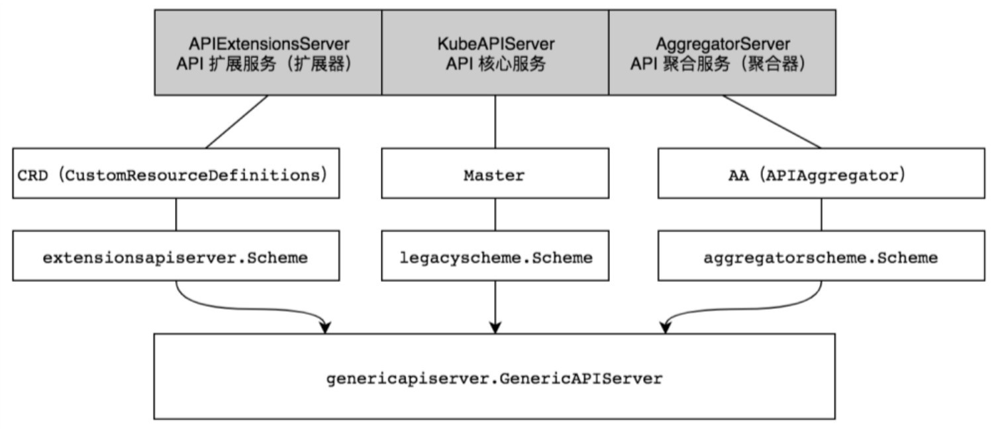

# 核心实现

## 1.热身概念

创建流程图

Kubernetes Pod资源对象创建流程介绍如下。
（1）使用kubectl工具向Kubernetes API Server发起创建Pod资源对象的请求。
（2）Kubernetes API Server验证请求并将其持久保存到Etcd集群中。
（3）Kubernetes API Server基于Watch机制通知kube-scheduler调度器。
（4）kube-scheduler调度器根据预选和优选调度算法为Pod资源对象选择最优的节点并通知Kubernetes API Server。
（5）Kubernetes API Server将最优节点持久保存到Etcd集群中。
（6）Kubernetes API Server通知最优节点上的kubelet组件。
（7）kubelet组件在所在的节点上通过与容器进程交互创建容器。
（8）kubelet组件将容器状态上报至Kubernetes API Server。
（9）Kubernetes API Server将容器状态持久保存到Etcd集群中。

https核心原理

（1）客户端首次请求服务端，告诉服务端自己支持的协议版本、支持的加密算法及压缩算法，并生成一个客户端随机数（ClientRandom）并告知服务端。
（2）服务端确认双方使用的加密算法，并返回给客户端证书及。一个服务端生成的服务端随机数（Server Random）。
（3）客户端收到证书后，首先验证证书的有效性，然后生成一个新的随机数（即Premaster Secret），使用数字证书中的公钥来加密这个随机数，并发送给服务端。
（4）服务端接收到已加密的随机数后，使用私钥进行解密，获取这个随机数（即Premaster Secret）。
（5）服务端和客户端根据约定的加密算法，使用前面的3个随机数（Client Random、Server Random、Premaster Secret），生成对话密钥（Session Key），用来加密接下来的整个对话过程

## 2.架构设计详解

kube-apiserver为丰富周边工具和库生态系统，提供了3种HTTP Server服务，用于将庞大的kube-apiserver组件功能进行解耦，这3种HTTP Server分别是APIExtensionsSerer、KubeAPIServer、AggregatorServer。不同服务的应用场景不同，提供的资源也不同，但它们都可以通过kubectl工具或接口进行资源

APIExtensionsServer扩展服务和AggregatorServer聚合服务都是可以在不修改Kubernetes核心代码的前提下扩展Kubernetes API的方式。只有KubeAPIServer核心服务是Kubernetes系统运行的基础，不建议随意修改它。

## 3.启动流程

在kube-apiserver组件启动过程中，代码逻辑可分为9个步骤，分别介绍如下。
（1）资源注册。
（2）Cobra命令行参数解析。
（3）创建APIServer通用配置。
（4）创建APIExtensionsServer。
（5）创建KubeAPIServer。
（6）创建AggregatorServer。
（7）创建GenericAPIServer。
（8）启动HTTP服务。
（9）启动HTTPS服务。

### 3.1 资源注册

kube-apiserver组件启动后的第一件事情是将Kubernetes所支持的资源注册到Scheme资源注册表中，这样后面启动的逻辑才能够从Scheme资源注册表中拿到资源信息并启动和运行APIExtensionsServer、KubeAPIServer、AggregatorServer这3种服务。
资源的注册过程并不是通过函数调用触发的，而是通过Go语言的导入（import）和初始化（init）机制触发的。

1. 初始化Scheme资源注册表
2. 注册Kubernetes所支持的资

### 3.2 Cobra命令行参数解

通过Cobra填充配置参数默认值并验证参数。

### 3.3 创建APIServer通用配置

**1 genericConfig实例化**

开启/禁用一些资源版本

**2 OpenAPI/Swagger配置**

**3 StorageFactory存储（Etcd）配置**

**4 Authentication认证配置**

接收组件与客户端的访问请求，每个请求都需要经过认证（Authentication）、授权（Authorization）及准入控制器（Admission Controller）3个阶段，之后才能真正地操作资源。

kube-apiserver目前提供了9种认证机制，分别是BasicAuth、ClientCA、TokenAuth、BootstrapToken 、 RequestHeader 、WebhookTokenAuth 、 Anonymous 、 OIDC 、ServiceAccountAuth。

**5 Authorization授权配**

**6 Admission准入控制器配置**
kube-apiserver目前提供了31种准入控制器，分别是AlwaysAdmit、AlwaysDeny、AlwaysPullImages、DefaultStorageClass、DefaultTolerationSeconds、DenyEscalatingExec、DenyExecOnPrivileged、EventRateLimit、ExtendedResourceToleration、ImagePolicyWebhook、LimitPodHardAntiAffinityTopology、LimitRanger、MutatingAdmissionWebhook、NamespaceAutoProvision、NamespaceExists、NamespaceLifecycle、NodeRestriction、OwnerReferencesPermissionEnforcement、PersistentVolumeClaimResize、Persistent VolumeLabel、PodNodeSelector、PodPreset、PodSecurityPolicy、PodTolerationRestriction、Priority、ResourceQuota、SecurityContextDeny、ServiceAccount、StorageObjectInUse Protection、TaintNodesByCondition、ValidatingAdmissionWebhook

### 3.4 创建APIExtensionsServer

（1）创建GenericAPIServer。

（2）实例化CustomResourceDefinitions。

（3）实例化APIGroupInfo，将资源版本、资源、资源存储对象进行相互映射。

（4）InstallAPIGroup注册APIGroup（apiextensions.k8s.io）。

### 3.5 创建KubeAPIServer

（1）创建GenericAPIServer。

（2）实例化Master。

（3）InstallLegacyAPI注册/api资源。

（4）InstallAPIs注册/apis资源。

### 3.6 创建AggregatorServer

### 3.7 创建GenericAPIServer

APIExtensionsServer、KubeAPIServer、AggregatorServer底层都依赖于GenericAPIServer。通过GenericAPIServer将k8s资源与REST API映射。

## 4 权限控制

Kubernetes支持3种安全权限控制，分别介绍如下。

- 认证：针对请求的认证，确认是否具有访问Kubernetes集群的权限。
- 授权：针对资源的授权，确认是否对资源具有相关权限。
- 准入控制器：在认证和授权之后，对象被持久化之前，拦截kube-apiserver的请求，拦截后的请求进入准入控制器中处理，对请求的资源对象进行自定义（校验、修改或拒绝）等操作。

## 5 认证

kube-apiserver目前提供了9种认证机制，分别是BasicAuth、ClientCA、TokenAuth、BootstrapToken、RequestHeader、WebhookTokenAuth、Anonymous、OIDC、ServiceAccountAuth。每一种认证机制被实例化后会成为认证器（Authenticator），每一个认证器都被封装在http.Handler请求处理函数中，它们接收组件或客户端的请求并认证请求。当客户端请求通过认证器并返回true时，则表示认证通过。

## 6 授权

kube-apiserver目前提供了6种授权机制，分别是AlwaysAllow、AlwaysDeny、ABAC、Webhook、RBAC、Node，可通过指定--authorization-mode参数设置授权机制。

- AlwaysAllow：允许所有请求。
- AlwaysDeny：阻止所有请求。
- ABAC：即Attribute-Based Access Control，基于属性的访问控制。
- Webhook：基于Webhook的一种HTTP协议回调，可进行远程授权管理。
- RBAC：即Role-Based Access Control，基于角色的访问控制。
- Node：节点授权，专门授权给kubelet发出的API请求。

## 7 进程信号处理

k8s是基于UNIX信号来实现的优雅退出

