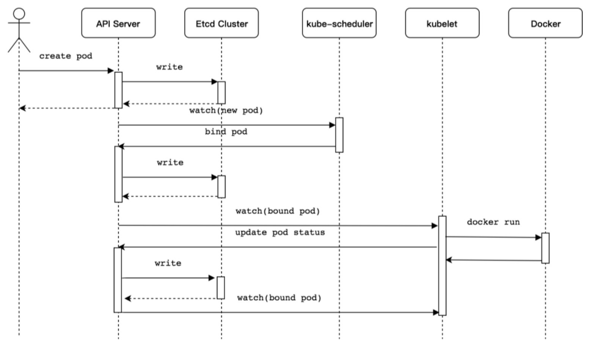
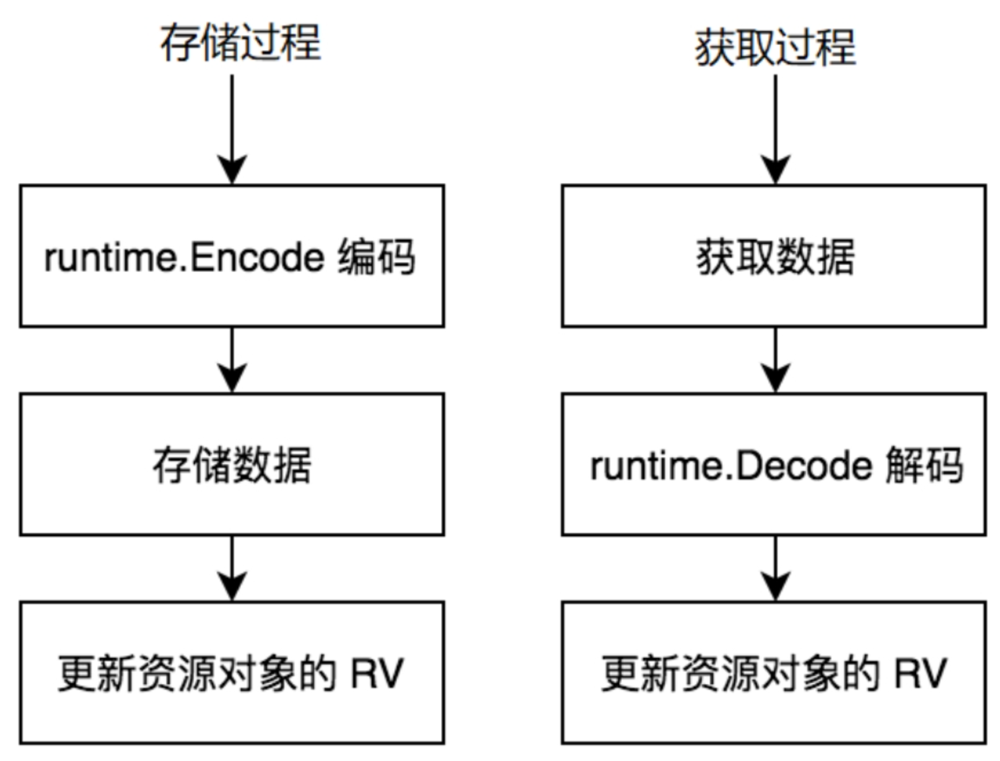

# apiserver解读

## 1.有什么功能

创建pod流程图



Kubernetes Pod资源对象创建流程介绍如下。
（1）使用kubectl工具向Kubernetes API Server发起创建Pod资源对象的请求。
（2）Kubernetes API Server验证请求并将其持久保存到Etcd集群中。
（3）Kubernetes API Server基于Watch机制通知kube-scheduler调度器。
（4）kube-scheduler调度器根据预选和优选调度算法为Pod资源对象选择最优的节点并通知Kubernetes API Server。
（5）Kubernetes API Server将最优节点持久保存到Etcd集群中。
（6）Kubernetes API Server通知最优节点上的kubelet组件。
（7）kubelet组件在所在的节点上通过与容器进程交互创建容器。
（8）kubelet组件将容器状态上报至Kubernetes API Server。
（9）Kubernetes API Server将容器状态持久保存到Etcd集群中。

###  职责：

- 提供整个集群的api接口管理，提供api注册、发现 --- 通过go-restful框架实现
- 资源操作的唯一入口 --- 操作etcd资源
- 集群内部各个组件的枢纽
- 提供请求认证、授权、访问控制等安全控制

## 2.核心实现

[调用流程图](https://www.processon.com/view/link/5f5f7c887d9c0833ecdd8629)

### 热身概念


go-restful框架支持多个Container（容器）。一个Container就相当于一个HTTP Server，不同Container之间监控不同的地址和端口，对外提供不同的HTTP服务。每个Container可以包含多个WebService（Web服务），WebService相当于一组不同服务的分类，go-restful概念如图7-3所示，其中可分为Books、User等类别。每个WebService下又包含了多个Router（路由），Router根据HTTP请求的URL路由到对应的处理函数（即Handler Func）。


### 架构设计

kube-apiserver为丰富周边工具和库生态系统，提供了3种HTTP Server服务，用于将庞大的kube-apiserver组件功能进行解耦，这3种HTTP Server分别是APIExtensionsSerer、KubeAPIServer、AggregatorServer。不同服务的应用场景不同，提供的资源也不同，但它们都可以通过kubectl工具或接口进行资源


APIExtensionsServer扩展服务和AggregatorServer聚合服务都是可以在不修改Kubernetes核心代码的前提下扩展Kubernetes API的方式。只有KubeAPIServer核心服务是Kubernetes系统运行的基础。


## 3.初始化流程

在kube-apiserver组件启动过程中，代码逻辑可分为9个步骤，分别介绍如下。
（1）资源注册。
（2）Cobra命令行参数解析。
（3）创建APIServer通用配置。
（4）创建APIExtensionsServer。
（5）创建KubeAPIServer。
（6）创建AggregatorServer。
（7）创建GenericAPIServer。
（8）启动HTTP服务。
（9）启动HTTPS服务。


```go
func CreateServerChain(completedOptions completedServerRunOptions, stopCh <-chan struct{}) (*aggregatorapiserver.APIAggregator, error) {
	//zjz 通用配置
	kubeAPIServerConfig, serviceResolver, pluginInitializer, err := CreateKubeAPIServerConfig(completedOptions)
	if err != nil {
		return nil, err
	}

	// If additional API servers are added, they should be gated.
	apiExtensionsConfig, err := createAPIExtensionsConfig(*kubeAPIServerConfig.GenericConfig, kubeAPIServerConfig.ExtraConfig.VersionedInformers, pluginInitializer, completedOptions.ServerRunOptions, completedOptions.MasterCount,
		serviceResolver, webhook.NewDefaultAuthenticationInfoResolverWrapper(kubeAPIServerConfig.ExtraConfig.ProxyTransport, kubeAPIServerConfig.GenericConfig.EgressSelector, kubeAPIServerConfig.GenericConfig.LoopbackClientConfig, kubeAPIServerConfig.GenericConfig.TracerProvider))
	if err != nil {
		return nil, err
	}

	notFoundHandler := notfoundhandler.New(kubeAPIServerConfig.GenericConfig.Serializer, genericapifilters.NoMuxAndDiscoveryIncompleteKey)
	apiExtensionsServer, err := createAPIExtensionsServer(apiExtensionsConfig, genericapiserver.NewEmptyDelegateWithCustomHandler(notFoundHandler))
	if err != nil {
		return nil, err
	}

	kubeAPIServer, err := CreateKubeAPIServer(kubeAPIServerConfig, apiExtensionsServer.GenericAPIServer)
	if err != nil {
		return nil, err
	}

	// aggregator comes last in the chain
	aggregatorConfig, err := createAggregatorConfig(*kubeAPIServerConfig.GenericConfig, completedOptions.ServerRunOptions, kubeAPIServerConfig.ExtraConfig.VersionedInformers, serviceResolver, kubeAPIServerConfig.ExtraConfig.ProxyTransport, pluginInitializer)
	if err != nil {
		return nil, err
	}
	aggregatorServer, err := createAggregatorServer(aggregatorConfig, kubeAPIServer.GenericAPIServer, apiExtensionsServer.Informers)
	if err != nil {
		// we don't need special handling for innerStopCh because the aggregator server doesn't create any go routines
		return nil, err
	}

	return aggregatorServer, nil
}
```


#### 3.1 资源注册

kube-apiserver组件启动后的第一件事情是将Kubernetes所支持的资源注册到Scheme资源注册表中，这样后面启动的逻辑才能够从Scheme资源注册表中拿到资源信息并启动和运行APIExtensionsServer、KubeAPIServer、AggregatorServer这3种服务。
资源的注册过程并不是通过函数调用触发的，而是通过Go语言的导入（import）和初始化（init）机制触发的。

1. 初始化Scheme资源注册表
2. 注册Kubernetes所支持的资源

```go
func addKnownTypes(scheme *runtime.Scheme) error {
	if err := scheme.AddIgnoredConversionType(&metav1.TypeMeta{}, &metav1.TypeMeta{}); err != nil {
		return err
	}
	scheme.AddKnownTypes(SchemeGroupVersion,
		&Pod{},
		&PodList{},
		&PodStatusResult{},
		&PodTemplate{},
		&PodTemplateList{},
		&ReplicationControllerList{},
		&ReplicationController{},
		&ServiceList{},
		&Service{},
		&ServiceProxyOptions{},
		&NodeList{},
		&Node{},
		&NodeProxyOptions{},
		&Endpoints{},
		&EndpointsList{},
		&Binding{},
		&Event{},
		&EventList{},
		&List{},
		&LimitRange{},
		&LimitRangeList{},
		&ResourceQuota{},
		&ResourceQuotaList{},
		&Namespace{},
		&NamespaceList{},
		&ServiceAccount{},
		&ServiceAccountList{},
		&Secret{},
		&SecretList{},
		&PersistentVolume{},
		&PersistentVolumeList{},
		&PersistentVolumeClaim{},
		&PersistentVolumeClaimList{},
		&PodAttachOptions{},
		&PodLogOptions{},
		&PodExecOptions{},
		&PodPortForwardOptions{},
		&PodProxyOptions{},
		&ComponentStatus{},// Deprecated: This API is deprecated in v1.19+
		&ComponentStatusList{},// Deprecated: This API is deprecated in v1.19+
		&SerializedReference{},
		&RangeAllocation{},
		&ConfigMap{},
		&ConfigMapList{},
	)

	return nil
}
```

创建storage对象

```go
func (c LegacyRESTStorageProvider) NewLegacyRESTStorage(apiResourceConfigSource serverstorage.APIResourceConfigSource, restOptionsGetter generic.RESTOptionsGetter) (LegacyRESTStorage, genericapiserver.APIGroupInfo, error) {
	apiGroupInfo := genericapiserver.APIGroupInfo{
		PrioritizedVersions:          legacyscheme.Scheme.PrioritizedVersionsForGroup(""),
		VersionedResourcesStorageMap: map[string]map[string]rest.Storage{},
		Scheme:                       legacyscheme.Scheme,
		ParameterCodec:               legacyscheme.ParameterCodec,
		NegotiatedSerializer:         legacyscheme.Codecs,
	}
  //创建podTemplate的Storage
	podTemplateStorage, err := podtemplatestore.NewREST(restOptionsGetter)
	if err != nil {
		return LegacyRESTStorage{}, genericapiserver.APIGroupInfo{}, err
	}
	...
	podStorage, err := podstore.NewStorage(
		restOptionsGetter,
		nodeStorage.KubeletConnectionInfo,
		c.ProxyTransport,
		podDisruptionClient,
	)
	if err != nil {
		return LegacyRESTStorage{}, genericapiserver.APIGroupInfo{}, err
	}
  ...
  //绑定API路由和对应Storage对象
	storage := map[string]rest.Storage{}
	if resource := "pods"; apiResourceConfigSource.ResourceEnabled(corev1.SchemeGroupVersion.WithResource(resource)) {
		storage[resource] = podStorage.Pod
		storage[resource+"/attach"] = podStorage.Attach
		storage[resource+"/status"] = podStorage.Status
		storage[resource+"/log"] = podStorage.Log
		storage[resource+"/exec"] = podStorage.Exec
		storage[resource+"/portforward"] = podStorage.PortForward
		storage[resource+"/proxy"] = podStorage.Proxy
		storage[resource+"/binding"] = podStorage.Binding
		if podStorage.Eviction != nil {
			storage[resource+"/eviction"] = podStorage.Eviction
		}
		if utilfeature.DefaultFeatureGate.Enabled(features.EphemeralContainers) {
			storage[resource+"/ephemeralcontainers"] = podStorage.EphemeralContainers
		}

	}

	if resource := "podtemplates"; apiResourceConfigSource.ResourceEnabled(corev1.SchemeGroupVersion.WithResource(resource)) {
		storage[resource] = podTemplateStorage
	}
  ...
	if len(storage) > 0 {
		apiGroupInfo.VersionedResourcesStorageMap["v1"] = storage
	}

	return restStorage, apiGroupInfo, nil
}
```


添加路由

```go
func (a *APIInstaller) registerResourceHandlers(path string, storage rest.Storage, ws *restful.WebService) (*metav1.APIResource, *storageversion.ResourceInfo, error) {
	admit := a.group.Admit
  ...
  //// 1、判断该 resource 实现了哪些 REST 操作接口，以此来判断其支持的 verbs 以便为其添加路由
	// what verbs are supported by the storage, used to know what verbs we support per path
	creater, isCreater := storage.(rest.Creater)
	namedCreater, isNamedCreater := storage.(rest.NamedCreater)
	lister, isLister := storage.(rest.Lister)
	getter, isGetter := storage.(rest.Getter)
	getterWithOptions, isGetterWithOptions := storage.(rest.GetterWithOptions)
	gracefulDeleter, isGracefulDeleter := storage.(rest.GracefulDeleter)
	collectionDeleter, isCollectionDeleter := storage.(rest.CollectionDeleter)
	updater, isUpdater := storage.(rest.Updater)
	patcher, isPatcher := storage.(rest.Patcher)
	watcher, isWatcher := storage.(rest.Watcher)
	connecter, isConnecter := storage.(rest.Connecter)
	storageMeta, isMetadata := storage.(rest.StorageMetadata)
	storageVersionProvider, isStorageVersionProvider := storage.(rest.StorageVersionProvider)
	gvAcceptor, _ := storage.(rest.GroupVersionAcceptor)
	if !isMetadata {
		storageMeta = defaultStorageMetadata{}
	}

	if isNamedCreater {
		isCreater = true
	}
// 2、为 resource 添加对应的 actions 并根据是否支持 namespace 
	// Get the list of actions for the given scope.
	switch {
	case !namespaceScoped:
		// Handler for standard REST verbs (GET, PUT, POST and DELETE).
		// Add actions at the resource path: /api/apiVersion/resource
		actions = appendIf(actions, action{"LIST", resourcePath, resourceParams, namer, false}, isLister)
		actions = appendIf(actions, action{"POST", resourcePath, resourceParams, namer, false}, isCreater)
		actions = appendIf(actions, action{"DELETECOLLECTION", resourcePath, resourceParams, namer, false}, isCollectionDeleter)
		// DEPRECATED in 1.11
		actions = appendIf(actions, action{"WATCHLIST", "watch/" + resourcePath, resourceParams, namer, false}, allowWatchList)

		// Add actions at the item path: /api/apiVersion/resource/{name}
		actions = appendIf(actions, action{"GET", itemPath, nameParams, namer, false}, isGetter)
		if getSubpath {
			actions = appendIf(actions, action{"GET", itemPath + "/{path:*}", proxyParams, namer, false}, isGetter)
		}
		actions = appendIf(actions, action{"PUT", itemPath, nameParams, namer, false}, isUpdater)
		actions = appendIf(actions, action{"PATCH", itemPath, nameParams, namer, false}, isPatcher)
		actions = appendIf(actions, action{"DELETE", itemPath, nameParams, namer, false}, isGracefulDeleter)
		// DEPRECATED in 1.11
		actions = appendIf(actions, action{"WATCH", "watch/" + itemPath, nameParams, namer, false}, isWatcher)
		actions = appendIf(actions, action{"CONNECT", itemPath, nameParams, namer, false}, isConnecter)
		actions = appendIf(actions, action{"CONNECT", itemPath + "/{path:*}", proxyParams, namer, false}, isConnecter && connectSubpath)
	default:
    ...
		actions = appendIf(actions, action{"LIST", resourcePath, resourceParams, namer, false}, isLister)
		actions = appendIf(actions, action{"POST", resourcePath, resourceParams, namer, false}, isCreater)
		actions = appendIf(actions, action{"DELETECOLLECTION", resourcePath, resourceParams, namer, false}, isCollectionDeleter)
		// DEPRECATED in 1.11
		actions = appendIf(actions, action{"WATCHLIST", "watch/" + resourcePath, resourceParams, namer, false}, allowWatchList)

		actions = appendIf(actions, action{"GET", itemPath, nameParams, namer, false}, isGetter)
		if getSubpath {
			actions = appendIf(actions, action{"GET", itemPath + "/{path:*}", proxyParams, namer, false}, isGetter)
		}
		actions = appendIf(actions, action{"PUT", itemPath, nameParams, namer, false}, isUpdater)
		actions = appendIf(actions, action{"PATCH", itemPath, nameParams, namer, false}, isPatcher)
		actions = appendIf(actions, action{"DELETE", itemPath, nameParams, namer, false}, isGracefulDeleter)
		// DEPRECATED in 1.11
		actions = appendIf(actions, action{"WATCH", "watch/" + itemPath, nameParams, namer, false}, isWatcher)
		actions = appendIf(actions, action{"CONNECT", itemPath, nameParams, namer, false}, isConnecter)
		actions = appendIf(actions, action{"CONNECT", itemPath + "/{path:*}", proxyParams, namer, false}, isConnecter && connectSubpath)

	// 3、根据 action 创建对应的 route
	kubeVerbs := map[string]struct{}{}
	reqScope := handlers.RequestScope{
		Serializer:      a.group.Serializer,
		ParameterCodec:  a.group.ParameterCodec,
		Creater:         a.group.Creater,
		Convertor:       a.group.Convertor,
		Defaulter:       a.group.Defaulter,
		Typer:           a.group.Typer,
		UnsafeConvertor: a.group.UnsafeConvertor,
		Authorizer:      a.group.Authorizer,
...
	}
	...
    // 4、从 rest.Storage 到 restful.Route 映射
    // 为每个操作添加对应的 handler
		switch action.Verb {
		...
		case "POST": // Create a resource.
			var handler restful.RouteFunction
			if isNamedCreater {
				handler = restfulCreateNamedResource(namedCreater, reqScope, admit)
			} else {
				handler = restfulCreateResource(creater, reqScope, admit)
			}
			handler = metrics.InstrumentRouteFunc(action.Verb, group, version, resource, subresource, requestScope, metrics.APIServerComponent, deprecated, removedRelease, handler)
			handler = utilwarning.AddWarningsHandler(handler, warnings)
			article := GetArticleForNoun(kind, " ")
			doc := "create" + article + kind
			if isSubresource {
				doc = "create " + subresource + " of" + article + kind
			}
      //route与handler绑定
			route := ws.POST(action.Path).To(handler).
				Doc(doc).
				Param(ws.QueryParameter("pretty", "If 'true', then the output is pretty printed.")).
				Operation("create"+namespaced+kind+strings.Title(subresource)+operationSuffix).
				Produces(append(storageMeta.ProducesMIMETypes(action.Verb), mediaTypes...)...).
				Returns(http.StatusOK, "OK", producedObject).
				// TODO: in some cases, the API may return a v1.Status instead of the versioned object
				// but currently go-restful can't handle multiple different objects being returned.
				Returns(http.StatusCreated, "Created", producedObject).
				Returns(http.StatusAccepted, "Accepted", producedObject).
				Reads(defaultVersionedObject).
				Writes(producedObject)
			if err := AddObjectParams(ws, route, versionedCreateOptions, disabledParams...); err != nil {
				return nil, nil, err
			}
			addParams(route, action.Params)
			routes = append(routes, route)
		...
		default:
			return nil, nil, fmt.Errorf("unrecognized action verb: %s", action.Verb)
		}
		for _, route := range routes {
			route.Metadata(ROUTE_META_GVK, metav1.GroupVersionKind{
				Group:   reqScope.Kind.Group,
				Version: reqScope.Kind.Version,
				Kind:    reqScope.Kind.Kind,
			})
			route.Metadata(ROUTE_META_ACTION, strings.ToLower(action.Verb))
			ws.Route(route)
		}
		// Note: update GetAuthorizerAttributes() when adding a custom handler.
	}
...
	return &apiResource, resourceInfo, nil
}
```

createHandler 与etcd交互流程

```go
func createHandler(r rest.NamedCreater, scope *RequestScope, admit admission.Interface, includeName bool) http.HandlerFunc {
	return func(w http.ResponseWriter, req *http.Request) {
		// For performance tracking purposes.
		trace := utiltrace.New("Create", traceFields(req)...)
		defer trace.LogIfLong(500 * time.Millisecond)
		...
		gv := scope.Kind.GroupVersion()
    // 1、得到合适的SerializerInfo
		s, err := negotiation.NegotiateInputSerializer(req, false, scope.Serializer)
		if err != nil {
			scope.err(err, w, req)
			return
		}
// 2、找到合适的 decoder
		body, err := limitedReadBody(req, scope.MaxRequestBodyBytes)
		...
		validationDirective := fieldValidation(options.FieldValidation)
		decodeSerializer := s.Serializer
		if validationDirective == metav1.FieldValidationWarn || validationDirective == metav1.FieldValidationStrict {
			decodeSerializer = s.StrictSerializer
		}
		decoder := scope.Serializer.DecoderToVersion(decodeSerializer, scope.HubGroupVersion)
    trace.Step("About to convert to expected version")
     // 3、decoder 解码
		obj, gvk, err := decoder.Decode(body, &defaultGVK, original)
		...
		objGV := gvk.GroupVersion()
		if !scope.AcceptsGroupVersion(objGV) {
			err = errors.NewBadRequest(fmt.Sprintf("the API version in the data (%s) does not match the expected API version (%v)", objGV.String(), gv.String()))
			scope.err(err, w, req)
			return
		}
		trace.Step("Conversion done")

		// On create, get name from new object if unset
		if len(name) == 0 {
			_, name, _ = scope.Namer.ObjectName(obj)
		}
		if len(namespace) == 0 && scope.Resource == namespaceGVR {
			namespace = name
		}
		ctx = request.WithNamespace(ctx, namespace)

		ae := audit.AuditEventFrom(ctx)
		admit = admission.WithAudit(admit, ae)
		audit.LogRequestObject(req.Context(), obj, objGV, scope.Resource, scope.Subresource, scope.Serializer)

		userInfo, _ := request.UserFrom(ctx)

		// if this object supports namespace info
		if objectMeta, err := meta.Accessor(obj); err == nil {
			// ensure namespace on the object is correct, or error if a conflicting namespace was set in the object
			if err := rest.EnsureObjectNamespaceMatchesRequestNamespace(rest.ExpectedNamespaceForResource(namespace, scope.Resource), objectMeta); err != nil {
				scope.err(err, w, req)
				return
			}
		}

		trace.Step("About to store object in database")
    // 4、执行 kube-apiserver 启动时加载的 admission-plugins（webhook、validation）
		admissionAttributes := admission.NewAttributesRecord(obj, nil, scope.Kind, namespace, name, scope.Resource, scope.Subresource, admission.Create, options, dryrun.IsDryRun(options.DryRun), userInfo)
		requestFunc := func() (runtime.Object, error) {
			return r.Create(
				ctx,
				name,
				obj,
				rest.AdmissionToValidateObjectFunc(admit, admissionAttributes, scope),
				options,
			)
		}
		// 5、存入etcd（Create方法由每个Storage对象自己实现）
		result, err := finisher.FinishRequest(ctx, func() (runtime.Object, error) {
			if scope.FieldManager != nil {
				liveObj, err := scope.Creater.New(scope.Kind)
				if err != nil {
					return nil, fmt.Errorf("failed to create new object (Create for %v): %v", scope.Kind, err)
				}
				obj = scope.FieldManager.UpdateNoErrors(liveObj, obj, managerOrUserAgent(options.FieldManager, req.UserAgent()))
				admit = fieldmanager.NewManagedFieldsValidatingAdmissionController(admit)
			}
			if mutatingAdmission, ok := admit.(admission.MutationInterface); ok && mutatingAdmission.Handles(admission.Create) {
				if err := mutatingAdmission.Admit(ctx, admissionAttributes, scope); err != nil {
					return nil, err
				}
			}
			// Dedup owner references again after mutating admission happens
			dedupOwnerReferencesAndAddWarning(obj, req.Context(), true)
			result, err := requestFunc()
			// If the object wasn't committed to storage because it's serialized size was too large,
			// it is safe to remove managedFields (which can be large) and try again.
			if isTooLargeError(err) {
				if accessor, accessorErr := meta.Accessor(obj); accessorErr == nil {
					accessor.SetManagedFields(nil)
					result, err = requestFunc()
				}
			}
			return result, err
		})
		if err != nil {
			scope.err(err, w, req)
			return
		}
		trace.Step("Object stored in database")

		code := http.StatusCreated
		status, ok := result.(*metav1.Status)
		if ok && status.Code == 0 {
			status.Code = int32(code)
		}

		trace.Step("About to write a response")
		defer trace.Step("Writing http response done")
		transformResponseObject(ctx, scope, trace, req, w, code, outputMediaType, result)
	}
}
```


## 4.资源概念


● Group：被称为资源组，在Kubernetes API Server中也可称其为APIGroup。

● Version：被称为资源版本，在Kubernetes API Server中也可称其为APIVersions。

● Resource：被称为资源，在Kubernetes API Server中也可称其为APIResource。

● Kind：资源种类，描述Resource的种类，与Resource为同一级别。


```go
type Scheme struct {
	// 存储GVK与Type的映射关系。
	gvkToType map[schema.GroupVersionKind]reflect.Type

	// 存储Type与GVK的映射关系，一个Type会对应一个或多个GVK。
	typeToGVK map[reflect.Type][]schema.GroupVersionKind

	// 存储Type与GVK的映射关系，一个Type会对应一个或多个GVK。
	unversionedTypes map[reflect.Type]schema.GroupVersionKind

	// 存储Kind（资源种类）名称与UnversionedType的映射关系。
	unversionedKinds map[string]reflect.Type

	// Map from version and resource to the corresponding func to convert
	// resource field labels in that version to internal version.
	fieldLabelConversionFuncs map[schema.GroupVersionKind]FieldLabelConversionFunc

	// defaulterFuncs is a map to funcs to be called with an object to provide defaulting
	// the provided object must be a pointer.
	defaulterFuncs map[reflect.Type]func(interface{})

	// converter stores all registered conversion functions. It also has
	// default converting behavior.
	converter *conversion.Converter

	// versionPriority is a map of groups to ordered lists of versions for those groups indicating the
	// default priorities of these versions as registered in the scheme
	versionPriority map[string][]string

	// observedVersions keeps track of the order we've seen versions during type registration
	observedVersions []schema.GroupVersion

	// schemeName is the name of this scheme.  If you don't specify a name, the stack of the NewScheme caller will be used.
	// This is useful for error reporting to indicate the origin of the scheme.
	schemeName string
}
```


版本转换器


## 5.如何与etcd交互


### 通用存储接口


- Versioner：资源版本管理器，用于管理Etcd集群中的数据版本对象。
- Create：创建资源对象的方法。
- Delete：删除资源对象的方法。
- Watch：通过Watch机制监控资源对象变化方法，只应用于单个key。
- WatchList：通过Watch机制监控资源对象变化方法，应用于多个key（当前目录及目录下所有的key）。
- Get：获取资源对象的方法。
- GetToList：获取资源对象的方法，以列表（List）的形式返回。
- List：获取资源对象的方法，以列表（List）的形式返回。
- GuaranteedUpdate：保证传入的tryUpdate函数运行成功。
- Count：获取指定key下的条目数量。Storage.Interface是通用存储接口，实现通用存储接口的分别是CacherStorage资源存储对象和UnderlyingStorage资源存储对象，分别介绍如下。（确认一下）
- CacherStorage：带有缓存功能的资源存储对象，它定义在vendor/k8s.io/apiserver/pkg/storage/cacher/cacher.go中。
- UnderlyingStorage：底层存储对象，真正与Etcd集群交互的资源存储对象，它定义在vendor/k8s.io/apiserver/pkg/storage/etcd3/store.go中。

### CacherStorage缓存层


(上图：缓存的应用场景)

- 缓存命中：客户端发起请求，请求中的数据存于缓存层中，则从缓存层直接返回数据。
- 缓存回源：客户端发起请求，请求中的数据未存于缓存层中，此时缓存层向DB数据层获取数据（该过程被称为回源），DB数据层将数据返回给缓存层，缓存层收到数据并将数据更新到自身缓存中（以便下次客户端请求时提升缓存命中率），最后将数据返回给客户端。


### CacherStorage缓存层设计


- cacheWatcher：Watcher观察者管理。
- watchCache：通过Reflector框架与UnderlyingStorage底层存储对象交互，UnderlyingStorage与Etcd集群进行交互，并将回调事件分别存储至w.onEvent、w.cache、cache.Store中。
- Cacher：用于分发给目前所有已连接的观察者，分发过程通过非阻塞（Non-Blocking）机制实现。


1.cacheWatcher：

当客户端发起Watch请求时，通过newCacheWatcher函数实例化cacheWatcher对象，并为其分配一个id，该id是唯一的，从0开始计数，每次有新的客户端发送Watch请求时，该id会自增1，但在Kubernetes API Server重启时其会被清零。

```go

// Watch implements storage.Interface.
func (c *Cacher) Watch(ctx context.Context, key string, opts storage.ListOptions) (watch.Interface, error) {
	...
	func() {
		c.Lock()
		defer c.Unlock()
		// Update watcher.forget function once we can compute it.
		watcher.forget = forgetWatcher(c, c.watcherIdx, triggerValue, triggerSupported)
		c.watchers.addWatcher(watcher, c.watcherIdx, triggerValue, triggerSupported)

		// Add it to the queue only when the client support watch bookmarks.
		if watcher.allowWatchBookmarks {
			c.bookmarkWatchers.addWatcher(watcher)
		}
		c.watcherIdx++
	}()

	...
	return watcher, nil
}
```

在通过newCacheWatcher函数进行实例化时，内部会运行一个goroutine（即watcher.process函数），用于监控c.input Channel中的数据。当其中没有数据时，监控c.input Channel时处于阻塞状态；当其中有数据时，数据会通过ResultChan函数对外暴露，只发送大于ResourceVersion资源版本号的数据

```go
func (c *cacheWatcher) process(ctx context.Context, resourceVersion uint64) {
	...
	for {
		select {
		case event, ok := <-c.input:
			if !ok {
				return
			}
			// only send events newer than resourceVersion
			if event.ResourceVersion > resourceVersion {
				c.sendWatchCacheEvent(event)
			}
		case <-ctx.Done():
			return
		}
	}
}
```


2.watchCache

watchCache接收Reflector框架的事件回调，并实现了Add、Update、Delete方法，分别用于接收watch.Added、watch.Modified、watch.Deleted事件。通过goroutine （即w.processEvent函数）将事件分别存储到如下3个地方。

- w.onEvent：将事件回调给CacherStorage，CacherStorage将其分发给目前所有已连接的观察者，该过程通过非阻塞机制实现。
- w.cache：将事件存储至缓存滑动窗口，它提供了对Watch操作的缓存数据，防止因网络或其他原因观察者连接中断，导致事件丢失。
- cache.Store：将事件存储至本地缓存，cache.Store与client-go下的Indexer功能相同。更多关于Indexer的内容，请参考5.3.4节“Indexer”。

```go
func (w *watchCache) processEvent(event watch.Event, resourceVersion uint64, updateFunc func(*storeElement) error) error {
	if err := func() error {
		w.Lock()
		defer w.Unlock()

		previous, exists, err := w.store.Get(elem)
		if err != nil {
			return err
		}
		if exists {
			previousElem := previous.(*storeElement)
			wcEvent.PrevObject = previousElem.Object
			wcEvent.PrevObjLabels = previousElem.Labels
			wcEvent.PrevObjFields = previousElem.Fields
		}
		//存储至缓存滑动窗口
		w.updateCache(wcEvent)
		w.resourceVersion = resourceVersion
		defer w.cond.Broadcast()
		//存到本地缓存中
		return updateFunc(elem)
	}(); err != nil {
		return err
	}

	// Avoid calling event handler under lock.
	// This is safe as long as there is at most one call to Add/Update/Delete and
	// UpdateResourceVersion in flight at any point in time, which is true now,
	// because reflector calls them synchronously from its main thread.
	if w.eventHandler != nil {
		w.eventHandler(wcEvent)
	}
	return nil
}
```

3.Cacher

```go
func (c *Cacher) dispatchEvent(event *watchCacheEvent) {
	if event.Type == watch.Bookmark {
		...
	} else {
		...
		c.blockedWatchers = c.blockedWatchers[:0]
		for _, watcher := range c.watchersBuffer {
			if !watcher.nonblockingAdd(event) {
				c.blockedWatchers = append(c.blockedWatchers, watcher)
			}
		}

		if len(c.blockedWatchers) > 0 {
			startTime := time.Now()
			timeout := c.dispatchTimeoutBudget.takeAvailable()
			c.timer.Reset(timeout)
			timer := c.timer
			for _, watcher := range c.blockedWatchers {
        //事件分发到每个watcher中
				if !watcher.add(event, timer) {
					timer = nil
				}
			}
			if timer != nil && !timer.Stop() {
				<-timer.C
			}
			c.dispatchTimeoutBudget.returnUnused(timeout - time.Since(startTime))
		}
	}
}

func (c *cacheWatcher) add(event *watchCacheEvent, timer *time.Timer) bool {
	if c.nonblockingAdd(event) {
		return true
	}
	//超时则关闭该watcher
	closeFunc := func() {
		// This means that we couldn't send event to that watcher.
		// Since we don't want to block on it infinitely,
		// we simply terminate it.
		klog.V(1).Infof("Forcing %v watcher close due to unresponsiveness: %v. len(c.input) = %v, len(c.result) = %v", c.objectType.String(), c.identifier, len(c.input), len(c.result))
		terminatedWatchersCounter.WithLabelValues(c.objectType.String()).Inc()
		c.forget()
	}
	if timer == nil {
		closeFunc()
		return false
	}

	// OK, block sending, but only until timer fires.
	select {
  //发到channel中
	case c.input <- event:
		return true
	case <-timer.C:
		closeFunc()
		return false
	}
}
```

### 5.2 ResourceVersion

每次在修改Etcd集群存储的资源对象时，Kubernetes API Server都会更改ResourceVersion，使得client-go执行Watch操作时可以根据ResourceVersion来确定资源对象是否发生变化。当client-go断开时，只要从上一次的ResourceVersion继续监控（Watch操作），就能够获取历史事件，这样可以防止事件遗漏或丢失。

Kubernetes API Server对ResourceVersion资源版本号并没有实现一套管理机制，而是依赖于Etcd集群中的全局Index机制来进行管理的。在Etcd集群中，有两个比较关键的Index，分别是createdIndex和modifiedIndex，它们用于跟踪Etcd集群中的数据发生了什么。

- createdIndex：全局唯一且递增的正整数。每次在Etcd集群中创建key时其会递增。
- modifiedIndex：与createdIndex功能类似，每次在Etcd集群中修改key时其会递增。

modifiedIndex机制被Kubernetes系统用于获取资源版本号（ResourceVersion）。Kubernetes系统通过资源版本号的概念来实现乐观锁。

### 5.3 watchCache缓存滑动窗口

```go
type watchCache struct {
  ...
	// Maximum size of history window.
	capacity int
	// upper bound of capacity since event cache has a dynamic size.
	upperBoundCapacity int
	// lower bound of capacity since event cache has a dynamic size.
	lowerBoundCapacity int
	// cache is used a cyclic buffer - its first element (with the smallest
	// resourceVersion) is defined by startIndex, its last element is defined
	// by endIndex (if cache is full it will be startIndex + capacity).
	// Both startIndex and endIndex can be greater than buffer capacity -
	// you should always apply modulo capacity to get an index in cache array.
	cache      []*watchCacheEvent
	startIndex int
	endIndex   int
}
```

滑动窗口工作原理


```go
//更新数据
// Assumes that lock is already held for write.
func (w *watchCache) updateCache(event *watchCacheEvent) {
	w.resizeCacheLocked(event.RecordTime)
	if w.isCacheFullLocked() {
		// Cache is full - remove the oldest element.
		w.startIndex++
	}
	w.cache[w.endIndex%w.capacity] = event
	w.endIndex++
}
//动态窗口
// resizeCacheLocked resizes the cache if necessary:
// - increases capacity by 2x if cache is full and all cached events occurred within last eventFreshDuration.
// - decreases capacity by 2x when recent quarter of events occurred outside of eventFreshDuration(protect watchCache from flapping).
func (w *watchCache) resizeCacheLocked(eventTime time.Time) {
	if w.isCacheFullLocked() && eventTime.Sub(w.cache[w.startIndex%w.capacity].RecordTime) < eventFreshDuration {
		capacity := min(w.capacity*2, w.upperBoundCapacity)
		if capacity > w.capacity {
			w.doCacheResizeLocked(capacity)
		}
		return
	}
	if w.isCacheFullLocked() && eventTime.Sub(w.cache[(w.endIndex-w.capacity/4)%w.capacity].RecordTime) > eventFreshDuration {
		capacity := max(w.capacity/2, w.lowerBoundCapacity)
		if capacity < w.capacity {
			w.doCacheResizeLocked(capacity)
		}
		return
	}
}
```


Actor-1由于网络或其他原因，导致Watch操作中断，中断前只监控到了RV5（ResourceVersion）的数据，等网络恢复后，请求继续执行Watch操作并携带上RV=5的参数，这时watchCache则会从缓存滑动窗口中将历史RV6、RV7、RV8事件一次性返回给Actor-1。假设Actor-2请求执行Watch操作并携带上RV=0的参数，这时watchCache则会从cache.Store本地缓存中获取历史事件返回给Actor-2。

```go
func (w *watchCache) getAllEventsSinceLocked(resourceVersion uint64) (*watchCacheInterval, error) {
	size := w.endIndex - w.startIndex
	var oldest uint64
	...
	if resourceVersion == 0 {
		ci, err := newCacheIntervalFromStore(w.resourceVersion, w.store, w.getAttrsFunc)
		if err != nil {
			return nil, err
		}
		return ci, nil
	}
	if resourceVersion < oldest-1 {
		return nil, errors.NewResourceExpired(fmt.Sprintf("too old resource version: %d (%d)", resourceVersion, oldest-1))
	}

	// Binary search the smallest index at which resourceVersion is greater than the given one.
  //二分查找
	f := func(i int) bool {
		return w.cache[(w.startIndex+i)%w.capacity].ResourceVersion > resourceVersion
	}
	first := sort.Search(size, f)
  //根据resourceVersion大小排序
	indexerFunc := func(i int) *watchCacheEvent {
		return w.cache[i%w.capacity]
	}
  //按照区间获取历史
	ci := newCacheInterval(w.startIndex+first, w.endIndex, indexerFunc, w.indexValidator, &w.RWMutex)
	return ci, nil
}
```

### 5.4 UnderlyingStorage底层存储对象

UnderlyingStorage（底层存储），也称为BackendStorage（后端存储），是真正与Etcd集群交互的资源存储对象，

```go
func Create(c storagebackend.ConfigForResource, newFunc func() runtime.Object) (storage.Interface, DestroyFunc, error) {
	switch c.Type {
    //可以看到etcd2已经不支持
	case storagebackend.StorageTypeETCD2:
		return nil, nil, fmt.Errorf("%s is no longer a supported storage backend", c.Type)
	case storagebackend.StorageTypeUnset, storagebackend.StorageTypeETCD3:
		return newETCD3Storage(c, newFunc)
	default:
		return nil, nil, fmt.Errorf("unknown storage type: %s", c.Type)
	}
}
```





## ~~6.以创建pod为例~~


## 7.获取pod信息为例


## 遗留问题

**1.channel堆积怎么办**

超时则关闭该watcher。

```go
func (c *cacheWatcher) add(event *watchCacheEvent, timer *time.Timer) bool {
	if c.nonblockingAdd(event) {
		return true
	}
	//超时则关闭该watcher
	closeFunc := func() {
		// This means that we couldn't send event to that watcher.
		// Since we don't want to block on it infinitely,
		// we simply terminate it.
		klog.V(1).Infof("Forcing %v watcher close due to unresponsiveness: %v. len(c.input) = %v, len(c.result) = %v", c.objectType.String(), c.identifier, len(c.input), len(c.result))
		terminatedWatchersCounter.WithLabelValues(c.objectType.String()).Inc()
		c.forget()
	}
	if timer == nil {
		closeFunc()
		return false
	}

	// OK, block sending, but only until timer fires.
	select {
  //发到channel中
	case c.input <- event:
		return true
	case <-timer.C:
		closeFunc()
		return false
	}
}
```


**2.watch的上限**

无。取决于系统处理能力、节点数量、pod变更频率等。


**3.更新数据，细节**

1.拿key的resourceVersion

2.校验请求对象和原始对象的uid、resourceVersion是否一致

...

看《并发安全机制》章节


**4.是否允许用别的存储结构**

看了官方文档，是允许使用第三方存储的。具体代码逻辑尚不清楚。


**5.count是否是精确统计？使用场景是啥？**

是精确统计，结合etcd读原理解析

```go
func (s *store) Count(key string) (int64, error) {
	key = path.Join(s.pathPrefix, key)

	// We need to make sure the key ended with "/" so that we only get children "directories".
	// e.g. if we have key "/a", "/a/b", "/ab", getting keys with prefix "/a" will return all three,
	// while with prefix "/a/" will return only "/a/b" which is the correct answer.
	if !strings.HasSuffix(key, "/") {
		key += "/"
	}

	startTime := time.Now()
	getResp, err := s.client.KV.Get(context.Background(), key, clientv3.WithRange(clientv3.GetPrefixRangeEnd(key)), clientv3.WithCountOnly())
	metrics.RecordEtcdRequestLatency("listWithCount", key, startTime)
	if err != nil {
		return 0, err
	}
	return getResp.Count, nil
}
```


**6.下面这图是干嘛的，读数据会不会读到的数据不是最新的？**


是缓存的应用场景。

根据是否传resourceVersion决定是否直接读cache数据。

```go
func (c *Cacher) Get(ctx context.Context, key string, opts storage.GetOptions, objPtr runtime.Object) error {
	if opts.ResourceVersion == "" {
		// If resourceVersion is not specified, serve it from underlying
		// storage (for backward compatibility).
		return c.storage.Get(ctx, key, opts, objPtr)
	}

	// If resourceVersion is specified, serve it from cache.
	// It's guaranteed that the returned value is at least that
	// fresh as the given resourceVersion.
	getRV, err := c.versioner.ParseResourceVersion(opts.ResourceVersion)
	if err != nil {
		return err
	}

	if getRV == 0 && !c.ready.check() {
		// If Cacher is not yet initialized and we don't require any specific
		// minimal resource version, simply forward the request to storage.
		return c.storage.Get(ctx, key, opts, objPtr)
	}

	// Do not create a trace - it's not for free and there are tons
	// of Get requests. We can add it if it will be really needed.
	c.ready.wait()

	objVal, err := conversion.EnforcePtr(objPtr)
	if err != nil {
		return err
	}

	obj, exists, readResourceVersion, err := c.watchCache.WaitUntilFreshAndGet(getRV, key, nil)
	if err != nil {
		return err
	}

	if exists {
		elem, ok := obj.(*storeElement)
		if !ok {
			return fmt.Errorf("non *storeElement returned from storage: %v", obj)
		}
		objVal.Set(reflect.ValueOf(elem.Object).Elem())
	} else {
		objVal.Set(reflect.Zero(objVal.Type()))
		if !opts.IgnoreNotFound {
			return storage.NewKeyNotFoundError(key, int64(readResourceVersion))
		}
	}
	return nil
}
```

**7.resourceVersion到最大值了怎么办？**

这个值是uint64类型，取值范围：0 ~ 18446744073709551615

理论上100年都用不完。


## 参考文献

《Kubernetes源码剖析》

[《资深专家深度剖析Kubernetes API Server第1章（共3章）》](https://cloud.tencent.com/developer/article/1330591)

[《资深专家深度剖析Kubernetes API Server第2章（共3章）》](https://cloud.tencent.com/developer/article/1331578?from=article.detail.1330591)

[《资深专家深度剖析Kubernetes API Server第3章（共3章）》](https://cloud.tencent.com/developer/article/1335712?from=article.detail.1330591)

[《K8S-APIServer源码分析组件构成、原理、程序流程》](https://blog.csdn.net/qq_17305249/article/details/105639029)

https://www.jianshu.com/p/daa4ff387a78

 [访问docker-desktop-for-mac安装的kubernetes的etcd](https://blog.csdn.net/yezi1993/article/details/106430390)
