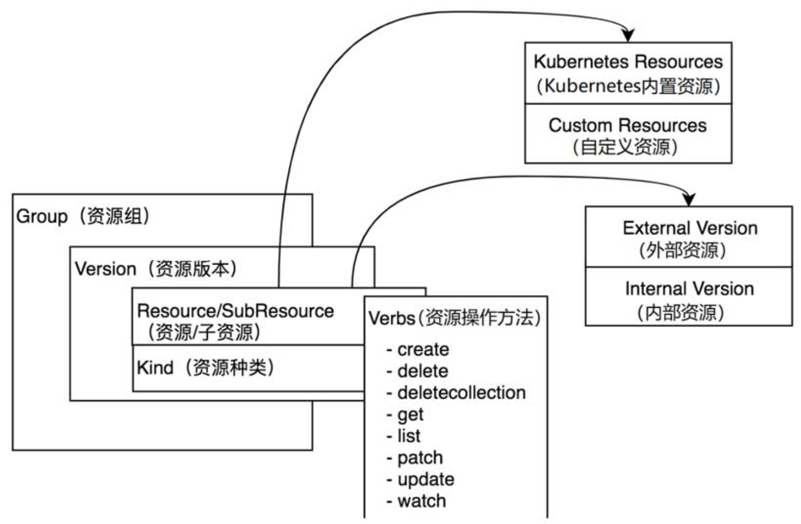
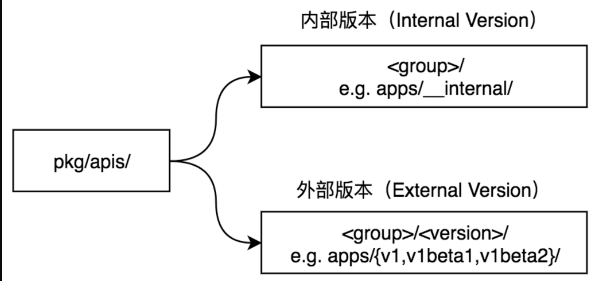
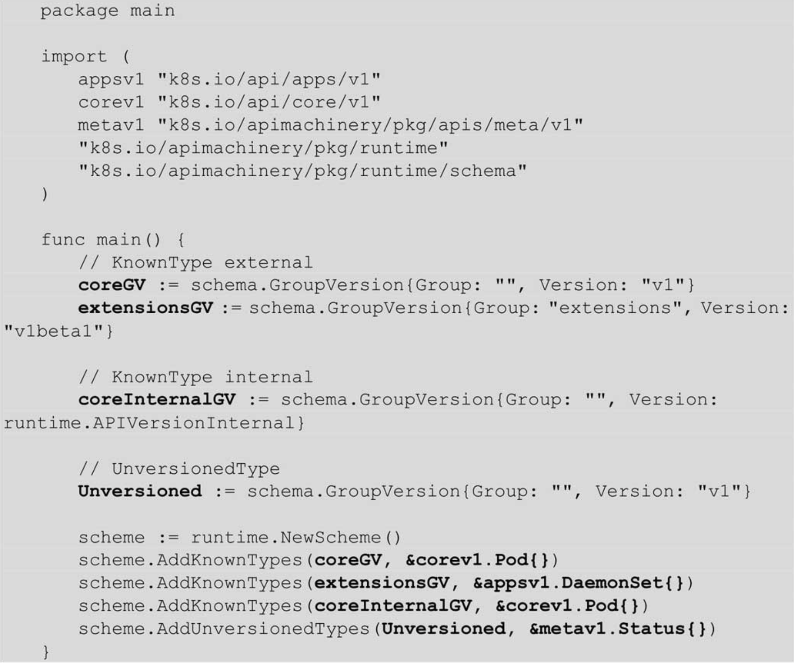
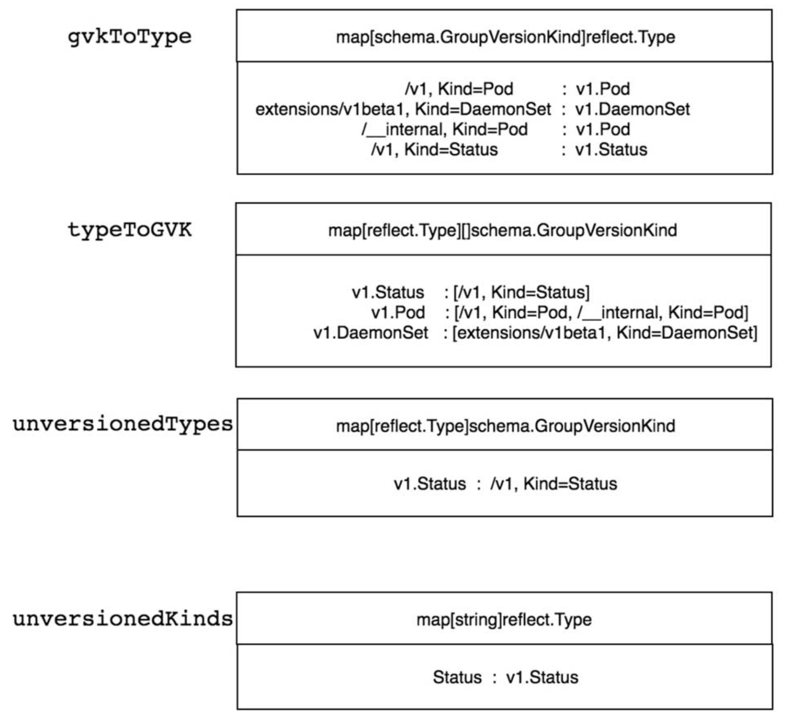
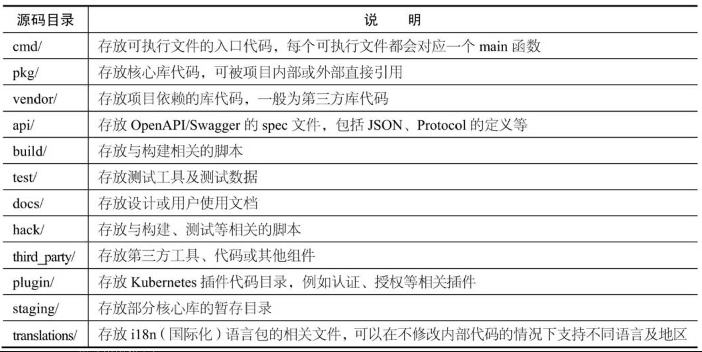
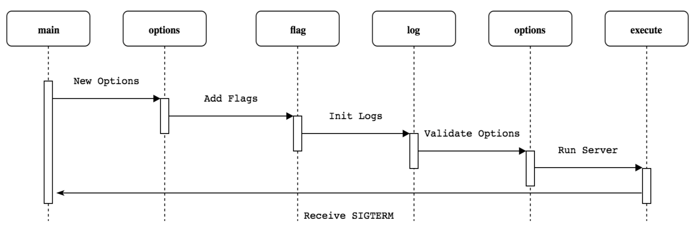
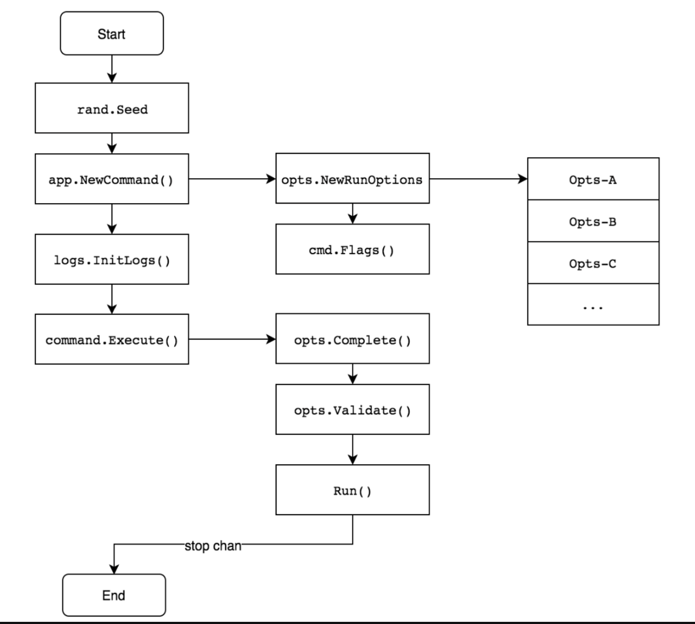

Kubernetes将资源再次分组和版本化，形成Group（资源组）、Version（资源版本）、Resource（资源）。Group、Version、Resource核心数据结构如图3-1所示。

Group：被称为资源组，在Kubernetes API Server中也可称其为APIGroup。

Version：被称为资源版本，在Kubernetes API Server中也可称其为APIVersions。

Resource：被称为资源，在Kubernetes API Server中也可称其为APIResource。

Kind：资源种类，描述Resource的种类，与Resource为同一级别。



资源组、资源版本、资源、子资源的完整表现形式为<group>/<version>/<resource>/<subresource>。以常用的Deployment资源为例，其完整表现形式为apps/v1/deployments/status。

那么pod的表现形式就是""/v1/pods/，核心资源没有<group>

目前Kubernetes系统支持8种资源操作方法，分别是create、delete、deletecollection、get、list、patch、update、watch操作方法。

资源数据结构

```go
type APIResource struct {
	// name is the plural name of the resource.
	Name string `json:"name" protobuf:"bytes,1,opt,name=name"`
	// singularName is the singular name of the resource.  This allows clients to handle plural and singular opaquely.
	// The singularName is more correct for reporting status on a single item and both singular and plural are allowed
	// from the kubectl CLI interface.
	SingularName string `json:"singularName" protobuf:"bytes,6,opt,name=singularName"`
	// namespaced indicates if a resource is namespaced or not.
	Namespaced bool `json:"namespaced" protobuf:"varint,2,opt,name=namespaced"`
	// group is the preferred group of the resource.  Empty implies the group of the containing resource list.
	// For subresources, this may have a different value, for example: Scale".
	Group string `json:"group,omitempty" protobuf:"bytes,8,opt,name=group"`
	// version is the preferred version of the resource.  Empty implies the version of the containing resource list
	// For subresources, this may have a different value, for example: v1 (while inside a v1beta1 version of the core resource's group)".
	Version string `json:"version,omitempty" protobuf:"bytes,9,opt,name=version"`
	// kind is the kind for the resource (e.g. 'Foo' is the kind for a resource 'foo')
	Kind string `json:"kind" protobuf:"bytes,3,opt,name=kind"`
	// verbs is a list of supported kube verbs (this includes get, list, watch, create,
	// update, patch, delete, deletecollection, and proxy)
	Verbs Verbs `json:"verbs" protobuf:"bytes,4,opt,name=verbs"`
	// shortNames is a list of suggested short names of the resource.
	ShortNames []string `json:"shortNames,omitempty" protobuf:"bytes,5,rep,name=shortNames"`
	// categories is a list of the grouped resources this resource belongs to (e.g. 'all')
	Categories []string `json:"categories,omitempty" protobuf:"bytes,7,rep,name=categories"`
	// The hash value of the storage version, the version this resource is
	// converted to when written to the data store. Value must be treated
	// as opaque by clients. Only equality comparison on the value is valid.
	// This is an alpha feature and may change or be removed in the future.
	// The field is populated by the apiserver only if the
	// StorageVersionHash feature gate is enabled.
	// This field will remain optional even if it graduates.
	// +optional
	StorageVersionHash string `json:"storageVersionHash,omitempty" protobuf:"bytes,10,opt,name=storageVersionHash"`
}
```

资源数据结构字段说明如下。

Name：资源名称。

SingularName：资源的单数名称，它必须由小写字母组成，默认使用资源种类（Kind）的小写形式进行命名。例如，Pod资源的单数名称为pod，复数名称为pods。

Namespaced：资源是否拥有所属命名空间。

Group：资源所在的资源组名称。Version：资源所在的资源版本。

Kind：资源种类。

Verbs：资源可操作的方法列表，例如get、list、delete、create、update等。ShortNames：资源的简称，例如Pod资源的简称为po。

在Kubernetes系统中，同一资源对应着两个版本，分别是外部版本和内部版本。



提示：在Kubernetes源码中，外部版本的资源类型定义在vendor/k8s.io/api目录下，其完整描述路径为vendor/k8s.io/api/<group>/<version>/<resource file>。例如，Pod资源的外部版本，定义在vendor/k8s.io/api/core/v1/目录下。

外部版本定义(vendor/k8s.io/api/core/v1/types.go)

```go
type PodTemplate struct {
	metav1.TypeMeta `json:",inline"`
	// Standard object's metadata.
	// More info: https://git.k8s.io/community/contributors/devel/sig-architecture/api-conventions.md#metadata
	// +optional
	metav1.ObjectMeta `json:"metadata,omitempty" protobuf:"bytes,1,opt,name=metadata"`

	// Template defines the pods that will be created from this pod template.
	// https://git.k8s.io/community/contributors/devel/sig-architecture/api-conventions.md#spec-and-status
	// +optional
	Template PodTemplateSpec `json:"template,omitempty" protobuf:"bytes,2,opt,name=template"`
}
```

内部版本定义(pkg/apis/core/types.go)

```go

type Pod struct {
	metav1.TypeMeta
	// +optional
	metav1.ObjectMeta

	// Spec defines the behavior of a pod.
	// +optional
	Spec PodSpec

	// Status represents the current information about a pod. This data may not be up
	// to date.
	// +optional
	Status PodStatus
}
```

### 资源代码定义

在pkg/apis/core目录下，

内部版本的资源结构如下：

- doc.go：GoDoc文件，定义了当前包的注释信息。在Kubernetes资源包中，它还担当了代码生成器的全局Tags描述文件。
- register.go：定义了资源组、资源版本及资源的注册信息。
- types.go：定义了在当前资源组、资源版本下所支持的资源类型。
- v1、v1beta1、v1beta2：定义了资源组下拥有的资源版本的资源（即外部版本）。
- install：把当前资源组下的所有资源注册到资源注册表中。
- validation：定义了资源的验证方法。
- zz_generated.deepcopy.go：定义了资源的深复制操作，该文件由代码生成器自动生成。

### 将资源注册到资源注册表中

在pkg/apis/core/install/install.go下

```go
func init() {
	Install(legacyscheme.Scheme)
}
func Install(scheme *runtime.Scheme) {
	utilruntime.Must(core.AddToScheme(scheme))
	utilruntime.Must(v1.AddToScheme(scheme))
	utilruntime.Must(scheme.SetVersionPriority(v1.SchemeGroupVersion))
}
```

legacyscheme.Scheme是kube-apiserver组件的全局资源注册表，Kubernetes的所有资源信息都交给资源注册表统一管理。core.AddToScheme函数注册core资源组内部版本的资源。v1.AddToScheme函数注册core资源组外部版本的资源。scheme.SetVersionPriority函数注册资源组的版本顺序，如有多个资源版本，排在最前面的为资源首选版本。

### 资源操作方法


（看不懂，先跳过，下次再回来看 3.5.5）

## 3.9 资源注册表

### 3.9.1 表数据结构

Scheme资源注册表数据结构主要由4个map结构组成，它们分别是gvkToType、typeToGVK、unversionedTypes、unversionedKinds，代码示例如下：代码路径：vendor/k8s.io/apimachinery/pkg/runtime/scheme.go

```go
type Scheme struct {
	// gvkToType allows one to figure out the go type of an object with
	// the given version and name.
	gvkToType map[schema.GroupVersionKind]reflect.Type

	// typeToGVK allows one to find metadata for a given go object.
	// The reflect.Type we index by should *not* be a pointer.
	typeToGVK map[reflect.Type][]schema.GroupVersionKind

	// unversionedTypes are transformed without conversion in ConvertToVersion.
	unversionedTypes map[reflect.Type]schema.GroupVersionKind

	// unversionedKinds are the names of kinds that can be created in the context of any group
	// or version
	// TODO: resolve the status of unversioned types.
	unversionedKinds map[string]reflect.Type

	// Map from version and resource to the corresponding func to convert
	// resource field labels in that version to internal version.
	fieldLabelConversionFuncs map[schema.GroupVersionKind]FieldLabelConversionFunc

	// defaulterFuncs is a map to funcs to be called with an object to provide defaulting
	// the provided object must be a pointer.
	defaulterFuncs map[reflect.Type]func(interface{})

	// converter stores all registered conversion functions. It also has
	// default converting behavior.
	converter *conversion.Converter

	// versionPriority is a map of groups to ordered lists of versions for those groups indicating the
	// default priorities of these versions as registered in the scheme
	versionPriority map[string][]string

	// observedVersions keeps track of the order we've seen versions during type registration
	observedVersions []schema.GroupVersion

	// schemeName is the name of this scheme.  If you don't specify a name, the stack of the NewScheme caller will be used.
	// This is useful for error reporting to indicate the origin of the scheme.
	schemeName string
}
```

Scheme资源注册表结构字段说明如下。

- gvkToType：存储GVK与Type的映射关系。

- typeToGVK：存储Type与GVK的映射关系，一个Type会对应一个或多个GVK。

- unversionedTypes：存储UnversionedType与GVK的映射关系。

- unversionedKinds：存储Kind（资源种类）名称与UnversionedType的映射关系。

  下面是个例子

  



在运行过程中，kube-apiserver组件常对Scheme资源注册表进行查询，它提供了如下方法。

- scheme.KnownTypes：查询注册表中指定GV下的资源类型。
- scheme.AllKnownTypes：查询注册表中所有GVK下的资源类型。
- scheme.ObjectKinds：查询资源对象所对应的GVK，一个资源对象可能存在多个GVK。
- scheme.New：查询GVK所对应的资源对象。
- scheme.IsGroupRegistered：判断指定的资源组是否已经注册。
- scheme.IsVersionRegistered：判断指定的GV是否已经注册。
- scheme.Recognizes：判断指定的GVK是否已经注册。
- scheme.IsUnversioned：判断指定的资源对象是否属于UnversionedType类型。

整个启动过程如下：

```sh
Run		/cmd/kube-apiserver/app/server.go
|--CreateServerChain
|  |--CreateKubeAPIServerConfig
|  |  |--buildGenericConfig
|  |     |--genericapiserver.NewConfig		
|  |     |--s.Authentication.ApplyTo
|  |     |--BuildAuthorizer
|  |     |--s.Admission.ApplyTo
|  |--createAPIExtensionsConfig
|  |--createAPIExtensionsServer
|  |  |--apiextensionsConfig.Complete().New	/vendor/k8s.io/apiextensions-apiserver/apiserver.go
|  |     |--c.GenericConfig.New
|  |     |--&CustomResourceDefinitions{}
|  |     |--genericapiserver.NewDefaultAPIGroupInfo
|  |     |--s.GenericAPIServer.InstallAPIGroup
|  |--CreateKubeAPIServer
|  |  |--kubeAPIServerConfig.Complete().New	/pkg/controlplane/instance.go
|  |  |  |--c.GenericConfig.New
|  |  |  |--&Instance{}
|  |  |  |--m.InstallLegacyAPI					/pkg/controlplane/instance.go
|  |  |  |  |--legacyRESTStorageProvider.NewLegacyRESTStorage	/pkg/registry/core/rest/storage_core.go
|  |  |  |  |--m.GenericAPIServer.InstallLegacyAPIGroup  ##相当于新版本的InstallAPIGroup
|  |  |  |  |  |--s.installAPIResources
|  |  |  |  |  |  |--apiGroupVersion.InstallREST
|  |  |  |--m.InstallAPIs
|  |--createAggregatorConfig
|  |--createAggregatorServer
|     |--aggregatorConfig.Complete().NewWithDelegate	/vendor/k8s.io/kube-aggregrator/pkg/apiserver/apiserver.go
|        |--c.GenericConfig.New				
|        |--&APIAggregator{}
|        |--apiservicerest.NewRESTStorage		
|        |--s.GenericAPIServer.InstallAPIGroup
|--server.PrepareRun			/vendor/k8s.io/kube-aggregrator/pkg/apiserver/apiserver.go
|  |--s.GenericAPIServer.PrepareRun	/vendor/k8s.io/kube-aggregrator/pkg/server/genericapiserver.go
|     |--s.installHealthz()		
|     |--s.installLivez()
|     |--s.installReadyz()
|--prepared.Run		/vendor/k8s.io/kube-aggregrator/pkg/apiserver/apiserver.go
   |--s.runnable.Run(stopCh)	
   |==preparedGenericAPIServer.Run	/vendor/k8s.io/apiserver/pkg/server/genericapiserver.go
      |--s.NonBlockingRun
         |--s.SecureServingInfo.Serve	/vendor/k8s.io/kube-aggregrator/pkg/server/secure_serving.go
            |--&http.Server{}
            |--RunServer
```

其它有用的：



初始化过程：





（1）rand.Seed：组件中的全局随机数生成对象。

（2）app.NewCommand：实例化命令行参数。通过flags对命令行参数进行解析并存储至Options对象中。

（3）logs.InitLogs：实例化日志对象，用于日志管理。

（4）command.Execute：组件进程运行的逻辑。运行前通过Complete函数填充默认参数，通过Validate函数验证所有参数，最后通过Run函数持久运行。只有当进程收到退出信号时，进程才会退出。

